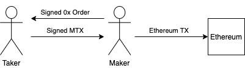

###############################
Meta-Transactions
###############################

Meta-Transactions are signed messages that instruct the 0x Protocol to run function(s) in the context of the signer. This signed mtx can then be shared off-chain, allowing anyone to execute on-chain. This is useful for integrators who would like to subsidize the Ethereum Gas Fee, or add custom smart contract logic to run atomically a fill. A signed meta-transaction can only be executed once.

A common use case for this is in Request For Quote (RFQ) systems. The Maker creates an order; the Taker signs a mtx permitting 0x Protocol to fill the order on their behalf; the mtx is returned to the Maker who submits it on-chain.

Constructing
============

To construct a Meta-Transaction, abi-encode the following struct and sign it.

.. code-block:: solidity

    /// @dev Describes an exchange proxy meta transaction.
    struct MetaTransactionData {
        // Signer of meta-transaction. On whose behalf to execute the MTX.
        address payable signer;
        // Required sender, or NULL for anyone.
        address sender;
        // Minimum gas price.
        uint256 minGasPrice;
        // Maximum gas price.
        uint256 maxGasPrice;
        // MTX is invalid after this time.
        uint256 expirationTimeSeconds;
        // Nonce to make this MTX unique.
        uint256 salt;
        // Encoded call data to a function on the exchange proxy.
        bytes callData;
        // Amount of ETH to attach to the call.
        uint256 value;
        // ERC20 fee `signer` pays `sender`.
        IERC20Token feeToken;
        // ERC20 fee amount.
        uint256 feeAmount;
    }

The ``calldata`` field is specific to the function you wish to execute. At this time, the following functions are supported:

- `fillLimitOrder <../basics/functions.html#filllimitorder>`_
- `fillRfqOrder <../basics/functions.html#fillrfqorder>`_
- `transformERC20 <../advanced/erc20_transformations.html>`_

Signing
=======

Meta-Transactions use the same signing technique as 0x Orders; see the `How to Sign <../basics/orders.html#how-to-sign>`_ section of the Orders documentation. See `getMetaTransactionHash`_ for generating a unique hash for your mtx.

Functionality
=============

+----------------------------------------+------------------------------------------------------------------------------------------------+
| Function                               | Overview                                                                                       |
+----------------------------------------+------------------------------------------------------------------------------------------------+
| `executeMetaTransaction`_              | Executes a single meta-transaction                                                             |
+----------------------------------------+------------------------------------------------------------------------------------------------+
| `batchExecuteMetaTransactions`_        | Executes a batch of meta-transactions.                                                         |
+----------------------------------------+------------------------------------------------------------------------------------------------+
| `getMetaTransactionExecutedBlock`_     | Returns the block that a meta-transaction was executed at.                                     |
+----------------------------------------+------------------------------------------------------------------------------------------------+
| `getMetaTransactionHashExecutedBlock`_ | Same as ``getMetaTransactionExecutedBlock``, only this function takes a meta-transaction hash. |
+----------------------------------------+------------------------------------------------------------------------------------------------+
| `getMetaTransactionHash`_              | Returns the hash of a meta-transaction.                                                        |
+----------------------------------------+------------------------------------------------------------------------------------------------+

executeMetaTransaction
----------------------

A single Meta-Transaction is executed by calling ``executeMetaTransaction``. A batch of mtx's can be executed by calling ``batchExecuteMetaTransactions``.

.. code-block:: solidity

    /// @dev Execute a single meta-transaction.
    /// @param mtx The meta-transaction.
    /// @param signature The signature by `mtx.signer`.
    /// @return returnResult The ABI-encoded result of the underlying call.
    function executeMetaTransaction(
        MetaTransactionData calldata mtx,
        LibSignature.Signature calldata signature
    )
        external
        payable
        returns (bytes memory returnResult);

A `MetaTransactionExecuted <../basics/events.html#metatransactionexecuted>`_ event is emitted on succes. The ``returnResult`` contains the raw return data for the executed function. For example, if the function returns a ``uint256`` then the ``returnResult`` could be abi-decoded into a ``uint256``.

This call will revert in the following scenarios:

- The address in the ``mtx.sender`` field does not match ``msg.sender``.
- The mtx has expired.
- The Ethereum transaction's gas price (``tx.gasprice``) is outside of the range ``[mtx.minGasPrice..mtx.maxGasPrice]``
- The ETH sent with the mtx is less than ``mtx.value``
- The allowance/balance of ``signer`` is insufficient to pay ``feeAmount`` of ``feeToken`` to the ``sender`` (if specified)
- The signature is invalid.
- The mtx was already executed
- The underlying function is not supported by meta-transactions (see list above).
- The underlying function call reverts.

batchExecuteMetaTransactions
----------------------------

.. code-block:: solidity

    /// @dev Execute multiple meta-transactions.
    /// @param mtxs The meta-transactions.
    /// @param signatures The signature by each respective `mtx.signer`.
    /// @return returnResults The ABI-encoded results of the underlying calls.
    function batchExecuteMetaTransactions(
        MetaTransactionData[] calldata mtxs,
        LibSignature.Signature[] calldata signatures
    )
        external
        payable
        returns (bytes[] memory returnResults);

A `MetaTransactionExecuted <../basics/events.html#metatransactionexecuted>`_ event is emitted for each mtx on succes. The ``returnResult`` contains the raw return data for the executed function This call will revert if the one of the ``mtxs`` reverts. Any exceess Ether will be refunded to the ``msg.sender``.

getMetaTransactionExecutedBlock
-------------------------------

The ``block.number`` is stored on-chain when a mtx is executed. This value can be retrieved using the following function.

.. code-block:: solidity

    /// @dev Get the block at which a meta-transaction has been executed.
    /// @param mtx The meta-transaction.
    /// @return blockNumber The block height when the meta-transactioin was executed.
    function getMetaTransactionExecutedBlock(MetaTransactionData calldata mtx)
        external
        view
        returns (uint256 blockNumber);

getMetaTransactionHashExecutedBlock
-----------------------------------

This is a more gas-efficient implementation of ``getMetaTransactionExecutedBlock``.

.. code-block:: solidity

    /// @dev Get the block at which a meta-transaction hash has been executed.
    /// @param mtxHash The meta-transaction hash.
    /// @return blockNumber The block height when the meta-transactioin was executed.
    function getMetaTransactionHashExecutedBlock(bytes32 mtxHash)
        external
        view
        returns (uint256 blockNumber);

getMetaTransactionHash
----------------------

The hash of the mtx is used to uniquely identify it inside the protocol. It is computed following the `EIP712 spec <https://github.com/ethereum/EIPs/blob/master/EIPS/eip-712.md>`_ standard. In solidity, the hash is computed using:

.. code-block:: solidity

    /// @dev Get the EIP712 hash of a meta-transaction.
    /// @param mtx The meta-transaction.
    /// @return mtxHash The EIP712 hash of `mtx`.
    function getMetaTransactionHash(MetaTransactionData calldata mtx)
        external
        view
        returns (bytes32 mtxHash);

The simplest way to generate an order hash is by calling this function, ex:

.. code-block:: solidity

    bytes32 orderHash = IZeroEx(0xDef1C0ded9bec7F1a1670819833240f027b25EfF).getMetaTransactionHash(mtx);

The hash can be manually generated using the following code:

.. code-block:: solidity

    bytes32 orderHash = keccak256(abi.encodePacked(
        '\x19\x01',
        // The domain separator.
        keccak256(abi.encode(
            // The EIP712 domain separator type hash.
            keccak256(abi.encodePacked(
                'EIP712Domain(',
                'string name,',
                'string version,',
                'uint256 chainId,',
                'address verifyingContract)'
            )),
            // The EIP712 domain separator values.
            'ZeroEx',
            '1.0.0',
            1, // For mainnet
            0xDef1C0ded9bec7F1a1670819833240f027b25EfF, // Address of the Exchange Proxy
        )),
        // The struct hash.
        keccak256(abi.encode(
            // The EIP712 type hash.
            keccak256(abi.encodePacked(
                "MetaTransactionData("
                "address signer,"
                "address sender,"
                "uint256 minGasPrice,"
                "uint256 maxGasPrice,"
                "uint256 expirationTimeSeconds,"
                "uint256 salt,"
                "bytes callData,"
                "uint256 value,"
                "address feeToken,"
                "uint256 feeAmount"
            ")"
            )),
            // The struct values.
            mtx.signer,
            mtx.sender,
            mtx.minGasPrice,
            mtx.maxGasPrice,
            mtx.expirationTimeSeconds,
            mtx.salt,
            keccak256(mtx.callData),
            mtx.value,
            mtx.feeToken,
            mtx.feeAmount
        ))
    ));

