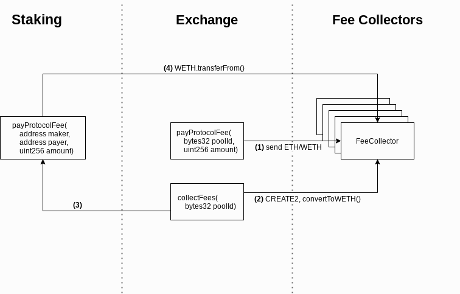

The [Protocol Fees](../basics/protocol_fees.html) are paid into special
Fee Collector contracts at time-of-fill. There is one collector for each
Staking Pool. The fees are paid in aggregate from the collector to the
[Staking System](../tokenomics/staking.md); this can happen at anytime,
but is most optimal to run during finalization. This increases the cost
of finalizing an epoch, but substantially reduces the transaction cost
for takers executing trades.

# Architecture

1.  There is one Fee Collector per staking pool. The fee collector
    serves as a repository for protocol fees attributed to a given pool.
    It automatically `approve()s` the staking contract so fees can be
    aggregated during finalization. It also contains functionality to
    convert ETH to WETH. Fee collectors are created using `CREATE2`.
    This gives us predictable addresses.
2.  When a [Limit Order](../basics/orders.html#limitorders) is filled,
    the protocol fee is paid to the Fee Collector that corresponds to
    `order.pool`.
3.  The [transferProtocolFeesForPools()
    \<../basics/functions.html\#transferprotocolfeesforpools\>]{.title-ref}
    function can be called to transfer the fees for a set of pools from
    their respective Fee Collectors into the Staking system.

{.align-center}
