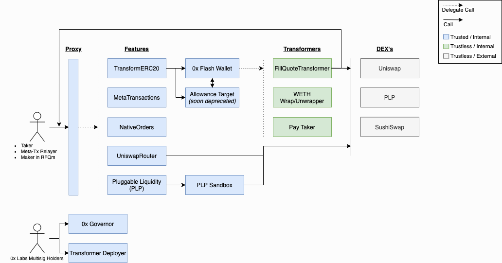

###############################
Overview
###############################

The `ZeroEx` (Exchange Proxy) contract implements a delegate-call proxy pattern to create a system of composable smart contracts. This architecture enables 0x Protocol to innovate with minimal friction alongside the growing DeFi ecosystem.

The diagram below illustrates our system (click to enlarge).

------------

The table below defines our smart contract nomenclature.

+-------------------------------------------------------+-----------------------------------------------------------------------------------------------------------------------------------------------------------------------------------------------+
| **Term**                                              | **Definition**                                                                                                                                                                                |
+-------------------------------------------------------+-----------------------------------------------------------------------------------------------------------------------------------------------------------------------------------------------+
| `Proxy <./proxy.html>`_                               | The point of entry into the system. This contract delegate-calls into Features.                                                                                                               |
+-------------------------------------------------------+-----------------------------------------------------------------------------------------------------------------------------------------------------------------------------------------------+
| `Features <./features.html>`_                         | These contracts implement the core feature set of the 0x Protocol. They are trusted with user allowances and permissioned by the 0x Governor.                                                 |
+-------------------------------------------------------+-----------------------------------------------------------------------------------------------------------------------------------------------------------------------------------------------+
| `Transformers <./transformers.html>`_                 | These contracts extend the core protocol. They are trustless and permissioned by the Transformer Deployer.                                                                                    |
+-------------------------------------------------------+-----------------------------------------------------------------------------------------------------------------------------------------------------------------------------------------------+
| `Flash Wallet <./flash_wallet.html>`_                 | The Flash Wallet is a sandboxed escrow contract that holds funds for Transformers to operate on. For example, the ``WETHtransformer`` wraps any Ether in the Flash Wallet.                    |
+-------------------------------------------------------+-----------------------------------------------------------------------------------------------------------------------------------------------------------------------------------------------+
| `Governor <./governor.html>`_                         | A smart contract that governs trusted contracts in the system: Proxy, Features, Flash Wallet.                                                                                                 |
+-------------------------------------------------------+-----------------------------------------------------------------------------------------------------------------------------------------------------------------------------------------------+
| `PLP Sandbox <./plp_sandbox.html>`_                   | `PLP <../advanced/plp.html>`_ liquidity providers are called from this sandbox.                                                                                                               |
+-------------------------------------------------------+-----------------------------------------------------------------------------------------------------------------------------------------------------------------------------------------------+