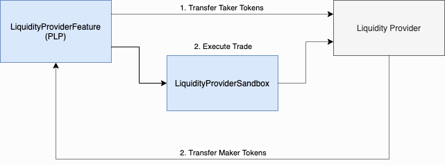

###############################
PLP Sandbox
###############################

`PLP <../advanced/plp.html>`_ are external, closed-source contracts that provide liquidity to the 0x Protocol. We want to limit the contracts called from the context of the `Proxy <./proxy.html>`_ contract because this contract has access to user funds. We must mitigate the attack vector where an ERC20 Token (or some other trusted contract) is passed in place of a legitimate PLP liquidity provider. We do this by routing trades through the PLP Sandbox.

The diagram below illustrates this workflow.

See the `PLP Section <../advanced/plp.html>`_ for usage. View the code for the PLP Sandbox is `here <https://github.com/0xProject/protocol/blob/development/contracts/zero-ex/contracts/src/external/LiquidityProviderSandbox.sol>`_.

