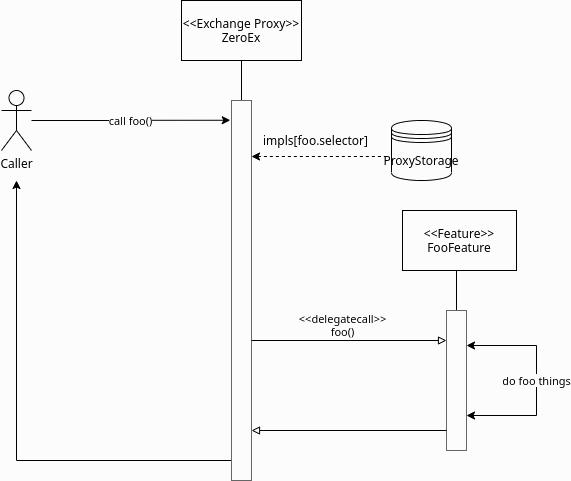
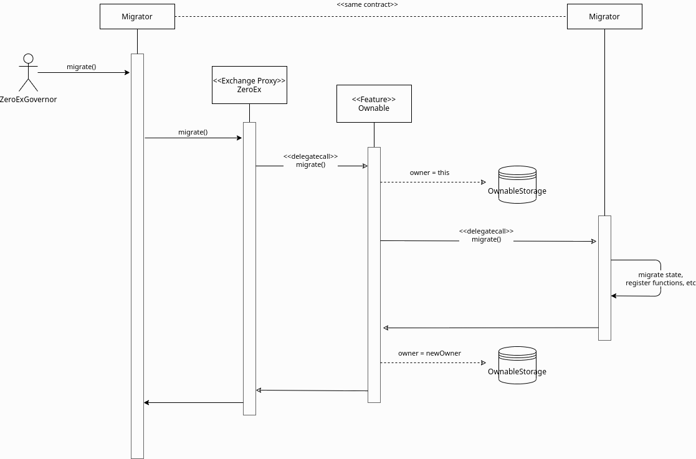
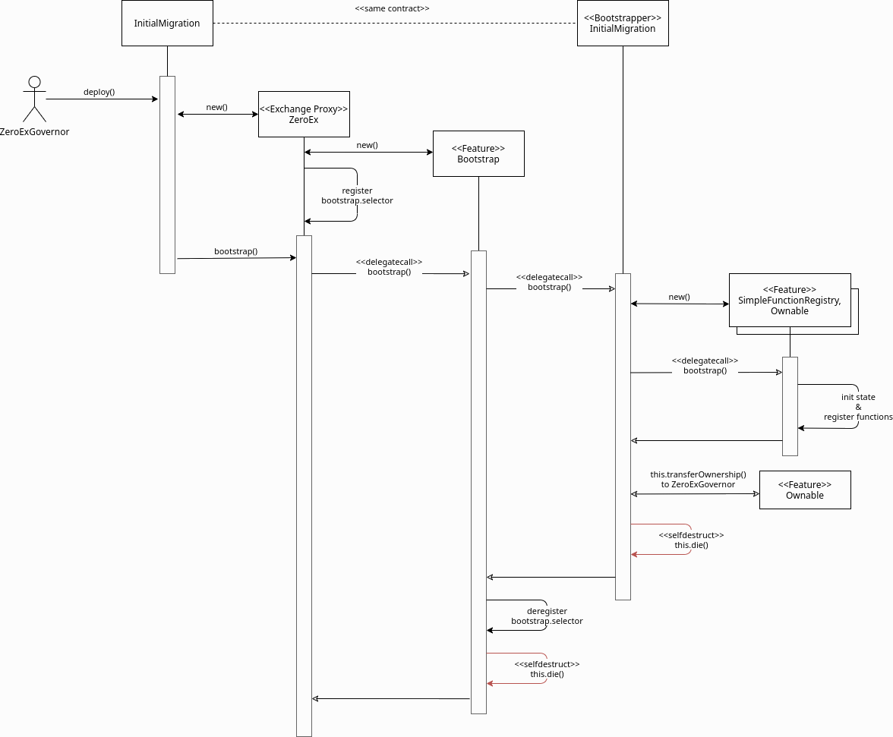

###############################
Proxy
###############################

The `ZeroEx <https://github.com/0xProject/protocol/blob/development/contracts/zero-ex/contracts/src/ZeroEx.sol>`_ contract (also called Exchange Proxy or EP) is the main contract that manages the process and performs the exchange of assets. It implements a per-function proxy pattern where each function can have a distinct implementation contract, also known as "features". The `ZeroEx` contract's sole responsibility is to maintain a mapping of "features" to implementation contracts and route (delegate) calls to per-function implementation contracts through its fallback mechanism. 

View the code for the Proxy `here <https://github.com/0xProject/protocol/blob/development/contracts/zero-ex/contracts/src/ZeroEx.sol>`_. The deployed contract address for each network can be found in `here <https://github.com/0xProject/protocol/blob/development/packages/contract-addresses/addresses.json>`_.

Deployment
==========
At deployment, the ``ZeroEx`` contract goes through an ``InitialMigration`` that bootstraps two core features to the proxy pattern: Function Registry and Ownership.

Function Registry
=================

``SimpleFunctionRegistry`` is one of the initial and core features of the `ZeroEx` contract boostrapped in during the ``InitialMigration``. This feature exposes the following function registry management features: ``extend()`` and ``rollback()``.

Call ``extend()`` to register a new function (selector) and implementation (address). This also maintains a history of past implementations so we can roll back to one, if needed.

.. code-block:: solidity

    // Register or replace a function.
    function extend(bytes4 selector, address impl)
        external
        onlyOwner;

Call ``rollback()`` to revert a function implementation to a prior version in its history.

.. code-block:: solidity

    // Roll back to a previousimplementation of a function.
    function rollback(bytes4 selector, address targetImpl)
        external
        onlyOwner;

Ownership
=========
``Ownable`` is another initial and core feature of the `ZeroEx` contract that is bootstrapped into the proxy during the ``InitialMigration``. This exposes ownership management functions: ``transferOwnership()`` and ``getOwner()``. This feature also enables ubiquitous modifiers such as onlyOwner, so it is an implicit dependency of nearly every other feature.

.. code-block:: solidity

    // Change the owner of this contract.
    function transferOwnership(address newOwner)
        external
        onlyOwner;

    /// @dev Get the owner of this contract.
    /// @return owner_ The owner of this contract.
    function owner()
        external
        view
        returns (address owner_);

Migrations
==========
Migrations are upgrade logic that run in the context of the proxy contract. To do this, the owner calls the ``migrate()`` function, provided by the ``Ownable`` Feature. This follows a similar sequence as the bootstrap process. Notably, it temporarily sets the owner of the contract to itself for the duration of the migration call, which allows the migrator to perform admin-level operations through other features, such as registering or rolling back new functions. Before exiting, the owner is set to the newOwner, which is passed in to the call.

One motivation for the existence of this function, as opposed to just having the make individual admin calls, is a shortcoming of the ZeroExGoverner contract, which is designed to perform one operation at a time, with no strict ordering of those operations.

This is a stripped down ``migrate()`` feature implementation:

.. code-block:: solidity

    contract Ownable {

        // Execute a migration function in the context of the proxy contract.
        function migrate(address target, bytes calldata data, address newOwner)
            external
            onlyOwner
        {
            // If the owner is already set to ourselves then we've reentered.
            require(OwnableStorage.owner != address(this));
            // Temporarily set the owner to ourselves.
            OwnableStorage.owner = address(this);

            // Perform the migration.
            target.delegatecall(data);

            // Set the new owner.
            OwnableStorage.owner = newOWner;
        }
    }

This is an example sequence of a migration (click to enlarge):

Storage Buckets
===============

Because feature functions get delegatecalled into, they all share the same execution context and, thus, state space. It’s critical that storage for each feature be compartmentalized from other features to avoid accidentally writing to the same slot. We solve this by strictly adhering to a storage bucket pattern for our feature contracts. This rule also extends to all inherited contracts/mixins.

Storage buckets are enabled by new language features in solidity 0.6, which allow us to rewrite a storage variable’s slot reference to a globally unique ID. These IDs are stored in an append-only enum defined in LibStorage, to enforce uniqueness. The true storage slot for a bucket is the feature’s storage ID multiplied by a large constant to prevent overlap between buckets.

Example:

.. code-block:: solidity

    LibStorage {
        enum StorageId {
            MyFeature
        }

        function getStorageSlot(StorageId id) internal pure returns (uint256) {
            return uint256(id) * 1e18;
        }
    }

    LibMyFeatureStorage {
        // Storage layout for this feature.
        struct Storage {
            mapping(bytes32 => bytes) myData;
        }

        // Get the storage bucket for this feature.
        function getStorage() internal view returns (Storage storage st) {
            uint256 slot = LibStorage.getStorageSlot(
                LibStorage.StorageId.MyFeature
            );
            assembly { st_slot := slot }
        }
    }

With the above pattern, writing to storage is simply:

.. code-block:: solidity

    LibMyFeatureStorage.getStorage().myData[...] = ...

Version Management
==================

**Inspection**

This is a rolling release model, where every feature/function has its own version. All feature contracts (except Bootstrap because it’s ephemeral), implement the IFeature interface:

.. code-block:: solidity

    interface IFeature {
        // The name of this feature set.
        function FEATURE_NAME() external view returns (string memory name);

        // The version of this feature set.
        function FEATURE_VERSION() external view returns (uint256 version);
    }

So, to get the version of a function one could do ``IFeature(getFunctionImplementation(foo.selector)).FEATURE_VERSION``.

**Best Practices**

The registry is intentionally not prescriptive on how features should be migrated. But there are some general best practices we can follow to avoid harming users, and ourselves.

**Deprecation**

In general, unless a function has a vulnerability, we should keep it intact for the duration of the deprecation schedule. Afterwards, we can ultimately disable the function by either calling extend() with a null implementation or by calling rollback() to a null implementation.

**Patches**

These include bug-fixes, optimizations, or any other changes that preserve the intended behavior of the function. For these cases, we should upgrade the function in-place, i.e., using the same selector but changing the implementation contract, through extend().

**Vulnerabilities**

If a vulnerability is found in a live function, we should call rollback() immediately to reset it to a non-vulnerable implementation. Because rollback() is a separate function from extend(), it can be exempted from timelocks to allow a swift response.

**Upgrades**

These involve meaningful behavioral changes, such as new settlement logic, changes to the order format (or its interpretation), etc. These should always be registered under a new selector, which comes free if the arguments also change, to allow users the opportunity to opt-in to new behavior. If the upgrade is intended to replace an existing feature, the old version should follow a deprecation schedule, unless we’re confident no one is using it.

**Features used by Features**

Not all features are designed to be exclusively consumed by the public. We can have internal features by applying an onlySelf modifier to the function. We need to be mindful of another class of user: the contract itself. Avoiding missteps on this will require a combination of diligence and good regression test suites.

Known Risks
===========

The extreme flexibility of this model means we have few built-in guardrails that more conventional architectures enjoy. To avoid pitfalls, we’ve established a few new patterns to follow during development, but the following areas will always need careful scrutiny during code reviews.

**Extended Attack Surface for Features**

Because features all run in the same execution context, they inherit potential vulnerabilities from other features. Some vulnerabilities may also arise from the interactions of separate features, which may not be obvious without examining the system as a whole. Reviewers will always need to be mindful of these scenarios and features should try to create as much isolation of responsibilities as possible.

**Storage Layout Risks**

All features registered to the proxy will run in the same storage context as the proxy itself. We employ a pattern of per-feature storage buckets (structs) with globally unique bucket slots to mitigate issues.

**Slot Overlap**

Every time we develop a new feature, an entry is appended to the ``LibStorage.StorageId`` enum, which is the bucket ID for the feature’s storage. This applies to the storage used by the proxy contract itself. When calculating the true slot for the storage bucket, this enum value is offset by ``1`` and bit shifted by ``128``:

.. code-block:: solidity

    function getStorageSlot(StorageId id) internal pure returns (uint256) {
        return (uint256(id) + 1) << 128;
    }

Given Solidity’s `storage layout rules <https://solidity.readthedocs.io/en/v0.6.6/miscellaneous.html)>`_, subsequent storage buckets should always be 2^128 slots apart, which means buckets can have 2^128 flattened inline fields before overlapping. While it’s not impossible for buckets to overlap with this pattern, it should be extremely unlikely if we follow it closely. Maps and arrays are not stored sequentially but should also be affected by their base slot value to make collisions unlikely.

**Inherited Storage**

A more insidious way to corrupt storage buckets is to have a feature unintentionally inherit from a mixin that has plain (non-bucketed) state variables, because the mixin can potentially read/write to slots shared by other buckets through them. To avoid this:

1. We prefix all feature-compatible mixins with “Fixin” (“Feature” + “Mixin”) and only allow contract inheritance from these.

2. Storage IDs are offset by 1 before computing the slot value. This means the first real storage bucket will actually start at slot 2^128, which gives us a safety buffer for these scenarios, since it’s unlikely a mixin would unintentionally access slots beyond 2^128.
Shared Access to Storage

There is nothing stopping a feature from reaching into another feature’s storage bucket and reading/modifying it. Generally this pattern is discouraged but may be necessary in some cases, or may be preferable to save gas. This can create an implicit tight coupling between features and we need to take those interactions into account when upgrading the features that own those storage buckets.

**Restricted Functions and Privilege Escalation**

We will also be registering functions that have caller restrictions. Functions designed for internal use only will have an onlySelf modifier that asserts that ``msg.sender == address(this)``. The other class of restricted functions are owner-only functions, which have an ``onlyOwner`` modifier that asserts that the ``msg.sender == LibOwnableStorage.Storage.owner``.

The check on owner-only functions can be easily circumvented in a feature by directly overwriting ``LibOwnableStorage.Storage.owner`` with another address. If best practices and patterns are adhered to, doing so would involve deliberate and obvious effort and should be caught in reviews.

**Self-Destructing Features**

A feature contract with self-destruct logic must safeguard this code path to only be executed after the feature is deregistered, otherwise its registered functions will fail. In most cases this would just cause the feature to temporarily go dark until we could redeploy it. But it may leave the proxy in an unusable state if this occurs in the contract of a mission-critical feature, e.g., Ownable or SimpleFunctionRegistry (neither of which can self-destruct).

Features should also be careful that ``selfdestruct`` is never executed in the context of the proxy to avoid destroying the proxy itself.

**Allowances**

Although the proxy will not have access to the V3 asset proxies initially, early features will require taker allowances to be accessible to the proxy somehow. Instead of having the proxy contract itself be the allowance target, we intend on using a separate “Puppet” contract, callable only by the proxy contract. This creates a layer of separation between the proxy contract and allowances, so moving user funds is a much more deliberate action. In the event of a major vulnerability, the owner can simply detach the puppet contract from the proxy. This also avoids the situation where the proxy has lingering allowances if we decide grant it asset proxy authorization.

**Balances**

Inevitably, there will be features that will cause the Exchange Proxy to hold temporary balances (e.g., payable functions). Thus, it’s a good idea that no feature should cause the Exchange Proxy to hold a permanent balance of tokens or ether, since these balances can easily get mixed up with temporary balances.

**Reentrancy**

Functions can be re-entered by default; those secured by the ``nonReentrant`` modifier cannot be re-entered.

**Colliding Function Selectors**

We manually ensure that function selectors do not collide during PR's. See the `Feature Checklist <./features.html#best-practices>`_ for a complete list of our best practices on Feature Development.

Initial Bootstrapping
=====================

The way that the initial bootstrapping is accomplished is through the ``bootstrap()`` function that can only be called by the deployer. Check `here <https://github.com/0xProject/protocol/blob/development/contracts/zero-ex/contracts/src/features/BootstrapFeature.sol>`_ to see the full boostrapping feature.

This function does a few things:
1. De-register the bootstrap() function, which prevents it being called again.
2. Self-destruct.
3. Delegatecall the bootstrapper target contract and call data.

.. code-block:: solidity

    // Execute a bootstrapper in the context of the proxy.
    function bootstrap(address target, bytes callData) external

Below is the bootstrap workflow (click to enlarge).

