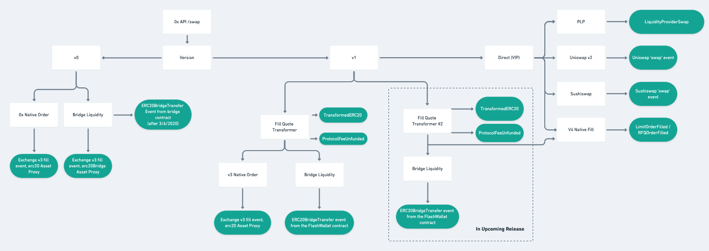

###############################
Events
###############################

This is a complete catalogue of 0x events emitted when interacting with the Exchange Proxy system of contracts. The diagram below
illustrates how events are emitted when trading through the Exchange Proxy.

.. warning::
    There are pending upgrades that impact these events. Please see the `Releases <../additional/releases.html>`_ page for more details.

.. note::
    This catalogue does not include events emitted by tokens or other exchanges, like Uniswap. It also only lists 0x V3 events
    that are emitted during a Fill; for an extensive list of V3 events, see the `V3 Spec <https://github.com/0xProject/0x-protocol-specification/blob/master/v3/v3-specification.md#events>`_.

+-------------------------------+-----------------------------------------------------------------------------------------------------------------------------------------------------------+---------------------+
| **Event**                     | **Description**                                                                                                                                           | **Emitted By**      |
+-------------------------------+-----------------------------------------------------------------------------------------------------------------------------------------------------------+---------------------+
| `Deployed`_                   | Emitted by the `Transformer Deployer <../architecture/transformer_deployer.html>`_ when a `Transformer <../architecture/transformers.html>`_ is deployed. | TransformerDeployer |
+-------------------------------+-----------------------------------------------------------------------------------------------------------------------------------------------------------+---------------------+
| `ERC20BridgeTransfer`_        | Emitted when a trade occurs.                                                                                                                              | FlashWallet         |
+-------------------------------+-----------------------------------------------------------------------------------------------------------------------------------------------------------+---------------------+
| `Fill`_                       | Emitted by Exchange V3 when an order is filled.                                                                                                           | Exchange V3         |
+-------------------------------+-----------------------------------------------------------------------------------------------------------------------------------------------------------+---------------------+
| `Killed`_                     | Emitted by the `Transformer Deployer <../architecture/transformer_deployer.html>`_ when a `Transformer <../architecture/transformers.html>`_ is killed.   | TransformerDeployer |
+-------------------------------+-----------------------------------------------------------------------------------------------------------------------------------------------------------+---------------------+
| `LimitOrderFilled`_           | Emitted when a `V4 Limit Order <./orders.html#limit-orders>`_ is filled.                                                                                  | ExchangeProxy       |
+-------------------------------+-----------------------------------------------------------------------------------------------------------------------------------------------------------+---------------------+
| `LiquidityProviderSwap`_      | Emitted when a `PLP <../advanced/plp.html>`_ executes a swap.                                                                                             | ExchangeProxy       |
+-------------------------------+-----------------------------------------------------------------------------------------------------------------------------------------------------------+---------------------+
| `OrderCancelled`_             | Emitted when a V4 Limit or RFQ Order is cancelled.                                                                                                        | ExchangeProxy       |
+-------------------------------+-----------------------------------------------------------------------------------------------------------------------------------------------------------+---------------------+
| `MetaTransactionExecuted`_    | Emitted when a meta-transaction is executed on the Exchange Proxy.                                                                                        | ExchangeProxy       |
|                               | Note that this differs from meta-transactions that are executed on Exchange V3.                                                                           |                     |
+-------------------------------+-----------------------------------------------------------------------------------------------------------------------------------------------------------+---------------------+
| `Migrated`_                   | Emitted when `ExchangeProxy.migrate()` is called.                                                                                                         | ExchangeProxy       |
+-------------------------------+-----------------------------------------------------------------------------------------------------------------------------------------------------------+---------------------+
| `PairCancelledLimitOrders`_   | Emitted when a Market Pair is cancelled for Limit Orders (see `cancelPairLimitOrders <./functions.html#cancelpairlimitorders>`_).                         | ExchangeProxy       |
+-------------------------------+-----------------------------------------------------------------------------------------------------------------------------------------------------------+---------------------+
| `PairCancelledRfqOrders`_     | Emitted when a Market Pair is cancelled for RFQ Orders (see `cancelPairRfqOrders <./functions.html#cancelpairrfqorders>`_).                               | ExchangeProxy       |
+-------------------------------+-----------------------------------------------------------------------------------------------------------------------------------------------------------+---------------------+
| `ProtocolFeeUnfunded`_        | Emitted when an order is skipped due to a lack of funds to pay the 0x Protocol fee.                                                                       | FlashWallet         |
+-------------------------------+-----------------------------------------------------------------------------------------------------------------------------------------------------------+---------------------+
| `ProxyFunctionUpdated`_       | Emitted when a function is upgraded via `extend()` or `rollback()`                                                                                        | ExchangeProxy       |
+-------------------------------+-----------------------------------------------------------------------------------------------------------------------------------------------------------+---------------------+
| `QuoteSignerUpdated`_         | Emitted when `ExchangeProxy.setQuoteSigner()` is called.                                                                                                  | ExchangeProxy       |
+-------------------------------+-----------------------------------------------------------------------------------------------------------------------------------------------------------+---------------------+
| `RfqOrderFilled`_             | Emitted when a `V4 RFQ Order <./orders.html#rfq-orders>`_ is filled.                                                                                      | ExchangeProxy       |
+-------------------------------+-----------------------------------------------------------------------------------------------------------------------------------------------------------+---------------------+
| `RfqOrderOriginsAllowed`_     | Emitted when a tx.origin is added/removed for RFQ, via `registerAllowedRfqOrigins <./functions.html#registerallowedrfqorigins>`_                          | ExchangeProxy       |
+-------------------------------+-----------------------------------------------------------------------------------------------------------------------------------------------------------+---------------------+
| `OrderSignerRegistered`_      | Emitted when an order signer is added/removed for a maker, via `registerAllowedOrderSigner <./functions.html#registerallowedordersigner>`_                | ExchangeProxy       |
+-------------------------------+-----------------------------------------------------------------------------------------------------------------------------------------------------------+---------------------+
| `TransformedERC20`_           | Emitted when an `ERC20 Transformation <../advanced/erc20_transformations.html>`_ completes.                                                               | ExchangeProxy       |
+-------------------------------+-----------------------------------------------------------------------------------------------------------------------------------------------------------+---------------------+
| `TransformerDeployerUpdated`_ | Emitted when the Transformer Deployer is upgraded.                                                                                                        | ExchangeProxy       |
+-------------------------------+-----------------------------------------------------------------------------------------------------------------------------------------------------------+---------------------+
| `TransformerMetadata`_        | A general, customizable event emitted that can be emitted by transformers as-needed.                                                                      | FlashWallet         |
+-------------------------------+-----------------------------------------------------------------------------------------------------------------------------------------------------------+---------------------+

Deployed
--------

.. code-block:: solidity

    /// @dev Emitted when a contract is deployed via `deploy()`.
    /// @param deployedAddress The address of the deployed contract.
    /// @param nonce The deployment nonce.
    /// @param sender The caller of `deploy()`.
    event Deployed(address deployedAddress, uint256 nonce, address sender);

ERC20BridgeTransfer
-------------------
.. code-block:: solidity

    /// @dev Emitted when a trade occurs.
    /// @param inputToken The token the bridge is converting from.
    /// @param outputToken The token the bridge is converting to.
    /// @param inputTokenAmount Amount of input token.
    /// @param outputTokenAmount Amount of output token.
    /// @param from The bridge address, indicating the underlying source of the fill.
    /// @param to The `to` address, currrently `address(this)`
    event ERC20BridgeTransfer(
        IERC20TokenV06 inputToken,
        IERC20TokenV06 outputToken,
        uint256 inputTokenAmount,
        uint256 outputTokenAmount,
        address from,
        address to
    );

Fill
----
.. code-block:: solidity

    event Fill(
        address indexed makerAddress,         // Address that created the order.
        address indexed feeRecipientAddress,  // Address that received fees.
        bytes makerAssetData,                 // Encoded data specific to makerAsset.
        bytes takerAssetData,                 // Encoded data specific to takerAsset.
        bytes makerFeeAssetData,              // Encoded data specific to makerFeeAsset.
        bytes takerFeeAssetData,              // Encoded data specific to takerFeeAsset.
        bytes32 indexed orderHash,            // EIP712 hash of order (see LibOrder.getTypedDataHash).
        address takerAddress,                 // Address that filled the order.
        address senderAddress,                // Address that called the Exchange contract (msg.sender).
        uint256 makerAssetFilledAmount,       // Amount of makerAsset sold by maker and bought by taker.
        uint256 takerAssetFilledAmount,       // Amount of takerAsset sold by taker and bought by maker.
        uint256 makerFeePaid,                 // Amount of makerFeeAssetData paid to feeRecipient by maker.
        uint256 takerFeePaid,                 // Amount of takerFeeAssetData paid to feeRecipient by taker.
        uint256 protocolFeePaid               // Amount of eth or weth paid to the staking contract.
    );

Killed
------

.. code-block:: solidity

    /// @dev Emitted when a contract is killed via `kill()`.
    /// @param target The address of the contract being killed..
    /// @param sender The caller of `kill()`.
    event Killed(address target, address sender);

LimitOrderFilled
----------------
.. code-block:: solidity

    /// @dev Emitted whenever a `LimitOrder` is filled.
    /// @param orderHash The canonical hash of the order.
    /// @param maker The maker of the order.
    /// @param taker The taker of the order.
    /// @param feeRecipient Fee recipient of the order.
    /// @param takerTokenFilledAmount How much taker token was filled.
    /// @param makerTokenFilledAmount How much maker token was filled.
    /// @param protocolFeePaid How much protocol fee was paid.
    /// @param pool The fee pool associated with this order.
    event LimitOrderFilled(
        bytes32 orderHash,
        address maker,
        address taker,
        address feeRecipient,
        address makerToken,
        address takerToken,
        uint128 takerTokenFilledAmount,
        uint128 makerTokenFilledAmount,
        uint128 takerTokenFeeFilledAmount,
        uint256 protocolFeePaid,
        bytes32 pool
    );

MetaTransactionExecuted
-----------------------

.. code-block:: solidity

    /// @dev Emitted whenever a meta-transaction is executed via
    ///      `executeMetaTransaction()` or `executeMetaTransactions()`.
    /// @param hash The meta-transaction hash.
    /// @param selector The selector of the function being executed.
    /// @param signer Who to execute the meta-transaction on behalf of.
    /// @param sender Who executed the meta-transaction.
    event MetaTransactionExecuted(
        bytes32 hash,
        bytes4 indexed selector,
        address signer,
        address sender
    );

LiquidityProviderSwap
---------------------

.. code-block:: solidity

    event LiquidityProviderSwap(
        address inputToken,
        address outputToken,
        uint256 inputTokenAmount,
        uint256 outputTokenAmount,
        address provider,
        address recipient
    );

Migrated
--------

.. code-block:: solidity

    /// @dev Emitted when `migrate()` is called.
    /// @param caller The caller of `migrate()`.
    /// @param migrator The migration contract.
    /// @param newOwner The address of the new owner.
    event Migrated(address caller, address migrator, address newOwner);

OrderCancelled
--------------

.. code-block:: solidity

    /// @dev Emitted whenever a limit or RFQ order is cancelled.
    /// @param orderHash The canonical hash of the order.
    /// @param maker The order maker.
    event OrderCancelled(
        bytes32 orderHash,
        address maker
    );

PairCancelledLimitOrders
------------------------

.. code-block:: solidity

    /// @dev Emitted whenever limit or RFQ orders are cancelled by pair by a maker.
    /// @param maker The maker of the order.
    /// @param makerToken The maker token in a pair for the orders cancelled.
    /// @param takerToken The taker token in a pair for the orders cancelled.
    /// @param minValidSalt The new minimum valid salt an order with this pair must
    ///        have.
    event PairCancelledLimitOrders(
        address maker,
        address makerToken,
        address takerToken,
        uint256 minValidSalt
    );

PairCancelledRfqOrders
----------------------

.. code-block:: solidity

    /// @dev Emitted whenever limit or RFQ orders are cancelled by pair by a maker.
    /// @param maker The maker of the order.
    /// @param makerToken The maker token in a pair for the orders cancelled.
    /// @param takerToken The taker token in a pair for the orders cancelled.
    /// @param minValidSalt The new minimum valid salt an order with this pair must
    ///        have.
    event PairCancelledRfqOrders(
        address maker,
        address makerToken,
        address takerToken,
        uint256 minValidSalt
    );

ProtocolFeeUnfunded
-------------------

.. code-block:: solidity

    /// @dev Emitted when a trade is skipped due to a lack of funds
    ///      to pay the 0x Protocol fee.
    /// @param orderHash The hash of the order that was skipped.
    event ProtocolFeeUnfunded(bytes32 orderHash);

ProxyFunctionUpdated
--------------------

.. code-block:: solidity

    /// @dev A function implementation was updated via `extend()` or `rollback()`.
    /// @param selector The function selector.
    /// @param oldImpl The implementation contract address being replaced.
    /// @param newImpl The replacement implementation contract address.
    event ProxyFunctionUpdated(bytes4 indexed selector, address oldImpl, address newImpl);

QuoteSignerUpdated
------------------
.. code-block:: solidity

    /// @dev Raised when `setQuoteSigner()` is called.
    /// @param quoteSigner The new quote signer.
    event QuoteSignerUpdated(address quoteSigner);

RfqOrderFilled
--------------
.. code-block:: solidity

    /// @dev Emitted whenever an `RfqOrder` is filled.
    /// @param orderHash The canonical hash of the order.
    /// @param maker The maker of the order.
    /// @param taker The taker of the order.
    /// @param takerTokenFilledAmount How much taker token was filled.
    /// @param makerTokenFilledAmount How much maker token was filled.
    /// @param pool The fee pool associated with this order.
    event RfqOrderFilled(
        bytes32 orderHash,
        address maker,
        address taker,
        address makerToken,
        address takerToken,
        uint128 takerTokenFilledAmount,
        uint128 makerTokenFilledAmount,
        bytes32 pool
    );

RfqOrderOriginsAllowed
-------------------------

.. code-block:: solidity

    /// @dev Emitted when new addresses are allowed or disallowed to fill
    ///      orders with a given txOrigin.
    /// @param origin The address doing the allowing.
    /// @param addrs The address being allowed/disallowed.
    /// @param allowed Indicates whether the address should be allowed.
    event RfqOrderOriginsAllowed(
        address origin,
        address[] addrs,
        bool allowed
    );

OrderSignerRegistered
-------------------------

.. code-block:: solidity

    /// @dev Emitted when new order signers are registered
    /// @param maker The maker address that is registering a designated signer.
    /// @param signer The address that will sign on behalf of maker.
    /// @param allowed Indicates whether the address should be allowed.
    event OrderSignerRegistered(
        address maker,
        address signer,
        bool allowed
    );

TransformedERC20
----------------

.. code-block:: solidity

    /// @dev Raised upon a successful `transformERC20`.
    /// @param taker The taker (caller) address.
    /// @param inputToken The token being provided by the taker.
    ///        If `0xeee...`, ETH is implied and should be provided with the call.`
    /// @param outputToken The token to be acquired by the taker.
    ///        `0xeee...` implies ETH.
    /// @param inputTokenAmount The amount of `inputToken` to take from the taker.
    /// @param outputTokenAmount The amount of `outputToken` received by the taker.
    event TransformedERC20(
        address indexed taker,
        address inputToken,
        address outputToken,
        uint256 inputTokenAmount,
        uint256 outputTokenAmount
    );

TransformerDeployerUpdated
--------------------------

.. code-block:: solidity

    /// @dev Raised when `setTransformerDeployer()` is called.
    /// @param transformerDeployer The new deployer address.
    event TransformerDeployerUpdated(address transformerDeployer);

TransformerMetadata
-------------------

.. code-block:: solidity

    /// @dev A transformer that just emits an event with an arbitrary byte payload.
    event TransformerMetadata(
        bytes32 callDataHash,
        address sender,
        address taker,
        bytes data
    );

