# Staking

## Table of Contents

1. [Overview](#overview)
   1. [Motivation](#motivation)
   1. [Utility of Stake](#utility-of-stake)
   1. [Staking Pools](#staking-pools)
1. [Architecture](#architecture)
   1. [Normal Mode](#normal-mode)
   1. [Catastrophic Failure Mode](#catastrophic-failure-mode)
1. [Contract Migrations](#contract-migrations)
   1. [Deploying the system](#deploying-the-system)
   1. [Upgrading `StakingProxy`](#upgrading-stakingproxy)
   1. [Upgrading `Staking` contract](#upgrading-staking-contract)
   1. [Upgrading `ZrxVault`](#upgrading-zrxvault)
   1. [Handling upgrades to the ERC20Proxy](#handling-upgrades-to-the-erc20proxy)
   1. [Setting Parameters](#setting-parameters)
   1. [Managing Exchange Addresses](#managing-exchange-addresses)
1. [Epochs & Scheduling](#epochs--scheduling)
   1. [Ending One Epoch, and Starting a New One](#ending-one-epoch-and-starting-a-new-one)
   1. [Logic of `endEpoch`](#logic-of-endepoch)
   1. [Errors by `endEpoch`](#errors-by-endepoch)
1. [Staking](#staking)
   1. [Logic of `stake`](#logic-of-stake)
   1. [Errors by `stake`](#errors-by-stake)
   1. [Logic of `unstake`](#logic-of-unstake)
   1. [Errors by `unstake`](#errors-by-unstake)
   1. [Staking Pools](#staking-pools)
   1. [Stake Status](#stake-status)
   1. [Logic of `moveStake`](#logic-of-movestake)
   1. [Errors by `moveStake`](#errors-by-movestake)
   1. [Querying Stake](#querying-stake)
1. [Liquidity Incentives](#liquidity-incentives)
   1. [Market Making](#market-making)
   1. [Logic of `createStakingPool`](#logic-of-createstakingpool)
   1. [Errors by `createStakingPool`](#errors-by-createstakingpool)
   1. [Logic of `decreaseStakingPoolOperatorShare`](#logic-of-decreasestakingpooloperatorshare)
   1. [Errors by `decreaseStakingPoolOperatorShare`](#errors-by-decreasestakingpooloperatorshare)
   1. [Logic of `joinStakingPoolAsMaker`](#logic-of-joinstakingpoolasmaker)
   1. [Errors by `joinStakingPoolAsMaker`](#errors-by-joinstakingpoolasmaker)
   1. [Paying Liquidity Rewards (Finalization)](#paying-liquidity-rewards-finalization)
   1. [Logic of `finalizePool`](#logic-of-finalizepool)
   1. [Precision of Rewards Computation](#precision-of-rewards-computation)
   1. [Errors by `finalizePool`](#errors-by-finalizepool)
   1. [Logic of `withdrawDelegatorRewards`](#logic-of-withdrawdelegatorrewards)
   1. [Errors by `withdrawDelegatorRewards`](#errors-by-withdrawdelegatorrewards)
1. [Batch Calls](#batch-calls)
   1. [Logic of `batchExecute`](#logic-of-batchexecute)
   1. [Errors by `batchExecute`](#errors-by-batchexecute)
1. [Paying the Protocol Fee](#paying-the-protocol-fee)
   1. [Logic of `payProtocolFee`](#logic-of-payprotocolfee)
   1. [Errors by `payProtocolFee`](#errors-by-payprotocolfee)
1. [Interfaces](#interfaces)
   1. [Staking Logic Contract](#staking-logic-contract)
   1. [`Staking` Contract State](#staking-contract-state)
   1. [`StakingProxy` Contract](#staking-proxy-contract)
   1. [`ZrxVault`](#zrx-vault)
   1. [Structs](#structs)
1. [Events](#events)
   1. [Staking Logic Contract](#staking-logic-contract)
   1. [`StakingProxy` Contract](#staking-proxy-contract)
   1. [`ZrxVault`](#zrx-vault)
1. [Algorithms, Data Structures & Design Patterns](#algorithms-data-structures--design-patterns)
   1. [Securing the Proxy Pattern](#securing-the-proxy-pattern)
   1. [Tracking for Reward Balances for Pool Members](#tracking-for-reward-balances-for-pool-members)
   1. [Computing Rewards in Practice](#computing-rewards-in-practice)
   1. [Handling Epochs With No Rewards](#handling-epochs-with-no-rewards)
   1. [Stake Management](#stake-management)

## 1 Overview

This spec outlines the architecture, implementation and usage of 0x stake-based liquidity incentives.

### Motivation

Staking aligns all market participants with the long-term mission and objectives of 0x. Specifically, it incentivizes ownership of the protocol among market makers through liquidity rewards. Rewards are generated by a protocol fee that is denominated in WETH and proportional to the gas cost of filling an order. The fee scales linearly with gas price to redirect proceeds from arbitrage-driven gas auctions back to market makers.

### Utility of Stake

Token holders stake their ZRX to unlock utility within the 0x ecosystem. This includes earning liquidity rewards through market making on the 0x protocol and participating in governance over the protocol.

A market maker provides liquidity by creating 0x orders that are filled by takers through the [`Exchange`](../v3/v3-specifications.md#exchange) contract. The `Exchange` charges a fee to the taker on each fill and forwards it to the [`Staking`](#staking) contract. The fee is attributed to the maker so long as they have created a staking pool that holds at least 100 ZRX. After every 7 day epoch, the fees are aggregated and distributed to the makers as a liquidity reward: the reward is proportional to the maker's collected fees and stake relative to other makers.

Governance over the protocol is conducted by voting on [ZEIPs (ZeroEx Improvement Proposals)](https://github.com/0xProject/ZEIPs). A ZEIP generally corresponds to a modification or upgrade to the 0x protocol. The ecosystem votes on the proposal, collectively deciding whether the feature will be included in a future version of the protocol. One Staked ZRX equals one vote.

### Staking Pools

Staking pools are created to leverage the weight of other stakers. A market maker, for example, can increase their liquidity reward without exposing themselves to the price fluctuations of the ZRX token. Market makers, in turn, incentivize delegators to contribute their ZRX by paying them a portion of the liquidity reward.

Staking pools can also be used to increase voting power. Delegators share a portion of their vote with the pool (50% of their vote goes to the pool operator and 50% is retained by the delegator), amplifying the pool's impact in governance over 0x. This allows stakers to form cliques within the greater governance system.

## Architecture

The system of staking contracts is composed of three contracts.

| Contract       	| Description                                                     	|
|----------------	|-----------------------------------------------------------------	|
| `Staking`      	| An upgradeable/stateless contract that implements staking logic 	|
| `StakingProxy` 	| Stores staking state and delegates to the `Staking` contract    	|
| `ZrxVault`     	| Securely holds staked ZRX Tokens                                	|

### Normal Mode

The diagram below shows how the staking contracts connect to each other and the broader 0x ecosystem.

<p align="center"></p>

### Catastrophic Failure Mode

In this worst-case scenario, state has been irreparably corrupted and the staking contracts must be redeployed. Users would withdraw their ZRX and re-stake under the new system.

1. The 0x `Exchange` contract stops charging protocol fees.
2. The `ZrxVault` is detached from the staking contract.
3. Users withdraw their funds from the `ZrxVault` directly.

<p align="center"></p>

## Contract Migrations

This section outlines steps for managing the system of smart contracts. Operations are atomically executed as a group. Contracts are owned by the [`ZeroExGovernor`](../architecture/governor.html).

### Deploying the system

1. Deploy `ZrxVault`.
2. Deploy `Staking` contract (address of `ZrxVault` is hardcoded in this contract).
3. Deploy `StakingProxy`.
4. Attach `Staking` contract to `StakingProxy`.

### Upgrading `StakingProxy`

1. Deploy new `StakingProxy`.
2. Set `StakingProxy` in `ZrxVault`.
3. Set `StakingProxy` in 0x Exchanges.

### Upgrading `Staking` contract

1. Deploy new `Staking` contract.
2. Attach `Staking` contract to `StakingProxy`.

### Upgrading `ZrxVault`

The `ZrxVault` address is hardcoded in the `Staking` contract and should not be upgraded. If it does need to be changed, then set the current `ZrxVault` into Catastrophic Failure mode (allowing users to withdraw their ZRX) and redeploy the entire system.

### Handling upgrades to the ERC20Proxy

The `ZrxVault` shares the `Exchange` contract's `ERC20Proxy`. It is possible this contract could get re-deployed for reasons outside of staking.

1. Update the ERC20 Asset Proxy in the `ZrxVault`.
2. Update the ZRX Asset Data (if necessary) in the `ZrxVault`.

### Setting Parameters

Configurable parameters can be set or queried using the functions below.

```solidity
/// @dev Set all configurable parameters at once.
/// @param _epochDurationInSeconds Minimum seconds between epochs.
/// @param _rewardDelegatedStakeWeight How much delegated stake is weighted vs operator stake, in ppm.
/// @param _minimumPoolStake Minimum amount of stake required in a pool to collect rewards.
/// @param _cobbDouglasAlphaNumerator Numerator for cobb douglas alpha factor.
/// @param _cobbDouglasAlphaDenominator Denominator for cobb douglas alpha factor.
function setParams(
    uint256 _epochDurationInSeconds,
    uint32 _rewardDelegatedStakeWeight,
    uint256 _minimumPoolStake,
    uint32 _cobbDouglasAlphaNumerator,
    uint32 _cobbDouglasAlphaDenominator
)
    external
    onlyAuthorized;

/// @dev Retrieves all configurable parameter values.
/// @return _epochDurationInSeconds Minimum seconds between epochs.
/// @return _rewardDelegatedStakeWeight How much delegated stake is weighted vs operator stake, in ppm.
/// @return _minimumPoolStake Minimum amount of stake required in a pool to collect rewards.
/// @return _cobbDouglasAlphaNumerator Numerator for cobb douglas alpha factor.
/// @return _cobbDouglasAlphaDenominator Denominator for cobb douglas alpha factor.
function getParams()
    external
    view
    returns (
        uint256 _epochDurationInSeconds,
        uint32 _rewardDelegatedStakeWeight,
        uint256 _minimumPoolStake,
        uint32 _cobbDouglasAlphaNumerator,
        uint32 _cobbDouglasAlphaDenominator
    );
```

Please refer to [ZEIP-61](https://github.com/0xProject/ZEIPs/issues/61) for a description of each parameter and justification for their starting values.

### Managing Exchange Addresses

Exchanges that generate protocol fees must be registered in the staking contract by an authorized address. The interface is described below.

```solidity
/// @dev Adds a new exchange address
/// @param addr Address of exchange contract to add
function addExchangeAddress(address addr)
    external
    onlyAuthorized;

/// @dev Removes an existing exchange address
/// @param addr Address of exchange contract to remove
function removeExchangeAddress(address addr)
    external
    onlyAuthorized;

/// @dev Returns true iff the input address is a valid exchange.
function validExchanges(address addr)
    public
    returns (bool isValid);
```

## Epochs & Scheduling

All processes in the system are segmented into contiguous time intervals, called epochs. Epochs have a fixed minimum period (7 days at time of writing), which is configurable via [MixinParams](https://github.com/0xProject/0x-monorepo/blob/development/contracts/staking/contracts/src/sys/MixinParams.sol). Epochs serve as the basis for all other timeframes within the system, which provides a more stable and consistent scheduling metric than blocks or block timestamps.

<p align="center">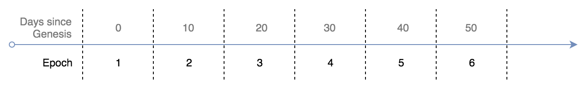</p>

### Ending One Epoch, and Starting a New One

A new epoch automatically begins when the current epoch ends. Anyone can end an epoch by calling the staking contract after the minimum epoch period has elapsed.

```solidity
/// @dev Begins a new epoch, preparing the prior one for finalization.
///      Throws if not enough time has passed between epochs or if the
///      previous epoch was not fully finalized.
/// @return numPoolsToFinalize The number of unfinalized pools.
function endEpoch()
    external
    returns (uint256 numPoolsToFinalize)
```

The return value describes the number of pools to finalize; this concept is described in [Section 6.2](#62-paying-liquidity-rewards-finalization).

#### Logic of `endEpoch`

When this function is called:

1. Assert the previous epoch (`currentEpoch-1`) is finalized: all rewards have been paid to pools.
2. Wrap any ETH into WETH (protocol fees can be paid in ETH or WETH, but rewards are always paid in WETH).
3. Store statistics on the epoch, including the total WETH in the contract - this value is the total reward available to pools.
4. Emit [EpochEnded](https://github.com/0xProject/0x-monorepo/blob/development/contracts/staking/contracts/src/interfaces/IStakingEvents.sol#L60) event.
5. Assert that enough time has elapsed to increment the epoch.
6. Increase the `currentEpoch` by 1.
7. If no pools earned rewards this epoch then the epoch is implicitly finalized; emit the [EpochFinalized](https://github.com/0xProject/0x-monorepo/blob/development/contracts/staking/contracts/src/interfaces/IStakingEvents.sol#L72) Event.

#### Errors by `endEpoch`

| Error                                                                                                                                                          | Condition                                                                            |
| -------------------------------------------------------------------------------------------------------------------------------------------------------------- | ------------------------------------------------------------------------------------ |
| [PreviousEpochNotFinalizedError](https://github.com/0xProject/0x-monorepo/blob/development/contracts/staking/contracts/src/libs/LibStakingRichErrors.sol#L294) | The previous epoch is not finalized: at least one pool has not been paid its reward. |
| [BlockTimestampTooLowError](https://github.com/0xProject/0x-monorepo/blob/development/contracts/staking/contracts/src/libs/LibStakingRichErrors.sol#L173)      | Not enough time has elapsed to end the epoch.                                        |

## Staking

ZRX is staked by depositing tokens into the `Staking` contract. The diagram below illustrates this workflow.

<p align="center">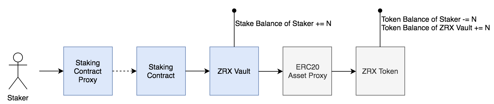</p>

ZRX can simlarly be unstaked by withdrawing tokens from the Staking contract. There are time-restrictions on unstaking, which are discussed later in this section.

Below is the interface for staking and unstaking.

```solidity
/// @dev Stake ZRX tokens. Tokens are deposited into the `ZrxVault`.
///      Unstake to retrieve the ZRX.
/// @param amount of ZRX to stake.
function stake(uint256 amount)
    external;

/// @dev Unstake. Tokens are withdrawn from the `ZrxVault` and returned to
///      the staker. Stake must be in the 'undelegated' status in both the
///      current and next epoch in order to be unstaked.
/// @param amount of ZRX to unstake.
function unstake(uint256 amount)
    external;
```

#### Logic of `stake`

1. Deposit ZRX tokens into `ZrxVault`.
2. `ZrxVault` emits the [Deposit](https://github.com/0xProject/0x-monorepo/blob/development/contracts/staking/contracts/src/interfaces/IZrxVault.sol#L34) event.
3. Increase the sender's stake balance.
4. Emit the [Stake](https://github.com/0xProject/0x-monorepo/blob/development/contracts/staking/contracts/src/interfaces/IStakingEvents.sol#L9) event.

#### Errors by `stake`

| Error                                                                                                                                                 | Condition                                                                                      |
| ----------------------------------------------------------------------------------------------------------------------------------------------------- | ---------------------------------------------------------------------------------------------- |
| [StandardError("TRANSFER_FAILED")](https://github.com/0xProject/0x-monorepo/blob/development/contracts/asset-proxy/contracts/src/ERC20Proxy.sol#L162) | Failed to deposit tokens into the `ZrxVault`; likely the user had an insufficient ZRX balance. |

#### Logic of `unstake`

1. Compute amount of staked ZRX that can be unstaked: this is the `min` of the user's undelegated stake in the current and next epoch.
2. Assert the amount to unstake is less or equal to the amount computed in (1).
3. Decrease the user's stake in the current and next epoch.
4. Transfer ZRX tokens from the `ZrxVault` to the user.
5. The `ZrxVault` emits the [Withdraw](https://github.com/0xProject/0x-monorepo/blob/development/contracts/staking/contracts/src/interfaces/IZrxVault.sol#L42) event.
6. Emit the [Unstake](https://github.com/0xProject/0x-monorepo/blob/development/contracts/staking/contracts/src/interfaces/IStakingEvents.sol#L17) event.

#### Errors by `unstake`

| Error                                                                                                                                                    | Condition                                     |
| -------------------------------------------------------------------------------------------------------------------------------------------------------- | --------------------------------------------- |
| [InsufficientBalanceError](https://github.com/0xProject/0x-monorepo/blob/development/contracts/staking/contracts/src/libs/LibStakingRichErrors.sol#L143) | Staked ZRX balance too low.                   |
| [StandardError("TRANSFER_FAILED")](https://github.com/0xProject/0x-monorepo/blob/development/contracts/asset-proxy/contracts/src/ERC20Proxy.sol#L162)    | Failed to withdraw tokens from the `ZrxVault` |

### Staking Pools

Staking pools can be created to leverage the weight of other stakers. A pool has a single operator and any number of members, who delegate their ZRX to the pool. Any staker can create a pool, although at present it is only beneficial for market makers to create staking pools. This is discussed more in [Section 6](#6-liquidity-incentives), along with details on creating a staking pool.

| Term          | Definition                                                                                 |
| ------------- | ------------------------------------------------------------------------------------------ |
| Pool Id       | A unique id generated by this contract and assigned to a pool when it is created.          |
| Pool Operator | The creator and operator of the pool.                                                      |
| Pool Members  | Stakers who delegate their ZRX to the pool in exchange for a portion of liquidity rewards. |
| Market Makers | Makers on the 0x protocol whose orders generate liquidity rewards for the pool.            |

It is presently intended for the pool operator to be sole the market maker of the pool. This is incentivized by making it more profitable for a maker to create their own pool over joining an existing one: the operator's stake is weighted greater than stake delegated by members when computing liquidity rewards.

### Stake Status

Each staked ZRX has an associated status that reflects its utility within the 0x Ecosystem.

| Status      | Definition                                                                                  |
| ----------- | ------------------------------------------------------------------------------------------- |
| Undelegated | Can be used to participate in governance. This is the default status.                       |
| Delegated   | ZRX is delegated to a pool; can be used in governance and contributes to liquidity rewards. |

There is a single function for moving stake between statuses:

```solidity
/// @dev Statuses that stake can exist in.
///      Any stake can be (re)delegated effective at the next epoch
///      Undelegated stake can be withdrawn if it is available in both the current and next epoch
enum StakeStatus {
    UNDELEGATED,
    DELEGATED
}

/// @dev Info used to describe a status.
/// @param status of the stake.
/// @param poolId Unique Id of pool. This is set when status=DELEGATED.
struct StakeInfo {
    StakeStatus status;
    bytes32 poolId;
}

/// @dev Moves stake between statuses: 'undelegated' or 'delegated'.
///      Delegated stake can also be moved between pools.
///      This change comes into effect next epoch.
/// @param from status to move stake out of.
/// @param to status to move stake into.
/// @param amount of stake to move.
function moveStake(
    IStructs.StakeInfo calldata from,
    IStructs.StakeInfo calldata to,
    uint256 amount
)
    external;
```

Note that when stake is moved its new status comes into effect on the _next epoch_. Stake's status remains unchanged over the duration of an epoch. See [section 11.4](#114-stake-management) for informaton on the implementation of stake accounting.

#### Logic of `moveStake`

1. No-op if amount to move is zero or moving both from and to the `undelegated` state.
2. If moving from `delegated` state then `undelegate` the stake.
   1. Sanity check the pool we're undelegating from exists.
   1. Withdraw any rewards owed to the delegator by this pool (see [Section 6.2.3](#623-logic-of-withdrawDelegatorRewards)).
   1. Decrease how much stake the staker has delegated to the input pool.
   1. Decrease how much stake has been delegated to pool.
   1. Decrease balance of global delegated stake (aggregated across all stakers).
3. If moving to `delegated` state then `delegate` the stake.
   1. Sanity check the pool we're delegating to exists.
   1. Withdraw any rewards owed to the delegator by this pool (see [Section 6.2.3](#623-logic-of-withdrawDelegatorRewards)).
   1. Increase how much stake the staker has delegated to the input pool.
   1. Increase how much stake has been delegated to pool.
   1. Increase balance of global delegated stake (aggregated across all stakers).
4. Execute move.
5. Emit the [MoveStake](https://github.com/0xProject/0x-monorepo/blob/development/contracts/staking/contracts/src/interfaces/IStakingEvents.sol#L25) event.

#### Errors by `moveStake`

| Error                                                                                                                                                    | Condition                                                                                                                           |
| -------------------------------------------------------------------------------------------------------------------------------------------------------- | ----------------------------------------------------------------------------------------------------------------------------------- |
| [InsufficientBalanceError](https://github.com/0xProject/0x-monorepo/blob/development/contracts/staking/contracts/src/libs/LibStakingRichErrors.sol#L143) | Staked ZRX balance too low.                                                                                                         |
| [PoolExistenceError](https://github.com/0xProject/0x-monorepo/blob/development/contracts/staking/contracts/src/libs/LibStakingRichErrors.sol#L234)       | Tried to un/delegate when pool does not exist.                                                                                      |
| [PoolNotFinalizedError](https://github.com/0xProject/0x-monorepo/blob/development/contracts/staking/contracts/src/libs/LibStakingRichErrors.sol#L309)    | The pool being un/delegated is not finalized: it is still owed rewards from the previous epoch. Fix this by calling `finalizePool`. |

### Querying Stake

The interface below describes how to query balances in the `Staking` contract.

```solidity
/// @dev Encapsulates a balance for the current and next epochs.
/// Note that these balances may be stale if the current epoch
/// is greater than `currentEpoch`.
/// @param currentEpoch the current epoch
/// @param currentEpochBalance balance in the current epoch.
/// @param nextEpochBalance balance in `currentEpoch+1`.
struct StoredBalance {
    uint64 currentEpoch;
    uint96 currentEpochBalance;
    uint96 nextEpochBalance;
}

/// @dev Gets global stake for a given status.
/// @param stakeStatus UNDELEGATED or DELEGATED
/// @return Global stake for given status.
function getGlobalStakeByStatus(IStructs.StakeStatus stakeStatus)
    external
    view
    returns (IStructs.StoredBalance memory balance);

/// @dev Gets an owner's stake balances by status.
/// @param staker Owner of stake.
/// @param stakeStatus UNDELEGATED or DELEGATED
/// @return Owner's stake balances for given status.
function getOwnerStakeByStatus(
    address staker,
    IStructs.StakeStatus stakeStatus
)
    external
    view
    returns (IStructs.StoredBalance memory balance);

/// @dev Returns the total stake for a given staker.
/// @param staker of stake.
/// @return Total ZRX staked by `staker`.
function getTotalStake(address staker)
    public
    view
    returns (uint256);

/// @dev Returns the stake delegated to a specific staking pool, by a given staker.
/// @param staker of stake.
/// @param poolId Unique Id of pool.
/// @return Stake delegated to pool by staker.
function getStakeDelegatedToPoolByOwner(address staker, bytes32 poolId)
    public
    view
    returns (IStructs.StoredBalance memory balance);

/// @dev Returns the total stake delegated to a specific staking pool,
///      across all members.
/// @param poolId Unique Id of pool.
/// @return Total stake delegated to pool.
function getTotalStakeDelegatedToPool(bytes32 poolId)
    public
    view
    returns (IStructs.StoredBalance memory balance);
```

## Liquidity Incentives

Liquidity incentives are used to align market participants with long-term objectives of the 0x protocol. Fees are charged by the 0x protocol and paid to market makers as a reward for their trade volume and amount of ZRX staked.

<p align="center">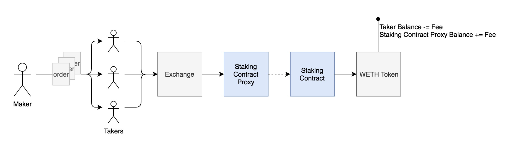</p>

The protocol fee is paid in either WETH or ETH. If ETH is not included in the transaction (by setting `msg.value`) then the fee will be taken in WETH from the taker, as illustrated in the diagram above.

Note also that the WETH allowances are set in the `StakingProxy` opposed to the standard ERC20 Asset Proxy, used by the exchange. There are two reasons for this. Firstly, this separation means that users must explicitly opt-in to fees (no hidden fees). Secondly, the `Staking` contract only needs access to WETH, whereas the ERC20 Proxy would provide access to _all_ tokens that a user has given allowance for; since the `Staking` contract is upgradable, this separation reduces the attack surface.

### Market Making

We want to align market makers with the long-term objectives of the 0x protocol; however, the immobility of staked ZRX exposes makers to potential short-term volatility in the crypto markets. This risk is mitigated through staking pools.

A maker creates a pool, which can be delegated to by any other staker. When computing a maker's reward, we account for all the stake in their pool. We favor ZRX staked directly by the maker by assigning a lower weight (90%) to ZRX delegated by other stakers.

Market makers incentivize delegators to join their pool by setting aside a fixed percentage of their reward for the members of their pool. A member receives an amount of this percentage that is proportional to how much stake they have delegated to the pool.

<p align="center">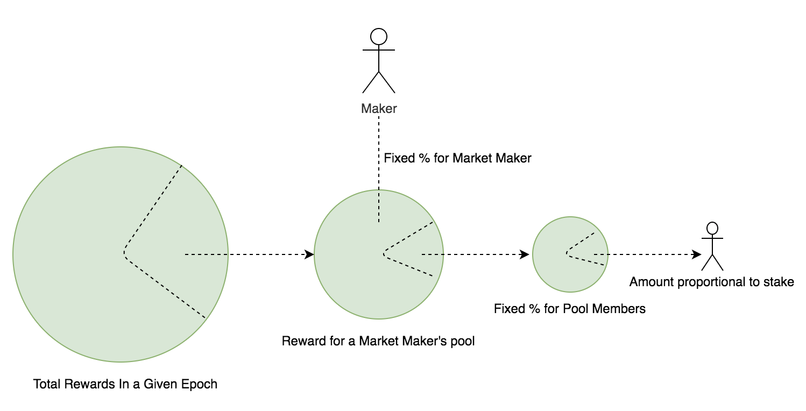</p>

The interface below describes how to create a pool, add market making addresses, and set the percentage of rewards for pool members.

Note that a single staker can operate several pools, but a market making address can only belong to one pool.
Note also that the operator's reward share can only be decreased: so the change can only ever benefit pool members.

```solidity
/// @dev Holds the metadata for a staking pool.
/// @param operator of the pool.
/// @param operatorShare Fraction of the total balance owned by the operator, in ppm.
struct Pool {
    address operator;
    uint32 operatorShare;
}

//// @dev Create a new staking pool. The sender will be the operator of this pool.
/// Note that an operator must be payable.
/// @param operatorShare Portion of rewards owned by the operator, in ppm.
/// @param addOperatorAsMaker Adds operator to the created pool as a maker for convenience iff true.
/// @return poolId The unique pool id generated for this pool.
function createStakingPool(uint32 operatorShare, bool addOperatorAsMaker)
    external
    returns (bytes32 poolId);

/// @dev Decreases the operator share for the given pool (i.e. increases pool rewards for members).
/// @param poolId Unique Id of pool.
/// @param newOperatorShare The newly decreased percentage of any rewards owned by the operator.
function decreaseStakingPoolOperatorShare(bytes32 poolId, uint32 newOperatorShare)
    external
    onlyStakingPoolOperator(poolId);

/// @dev Allows caller to join a staking pool as a maker.
/// @param poolId Unique id of pool.
function joinStakingPoolAsMaker(bytes32 poolId)
    public;

/// @dev Returns a staking pool
/// @param poolId Unique id of pool.
function getStakingPool(bytes32 poolId)
    public
    view
    returns (IStructs.Pool memory);
```

#### Logic of `createStakingPool`

1. Generate unique Pool Id.
2. Assert the operator's share of pool rewards is valid.
3. Store the newly created pool's information in state. This includes the operator's address and their share of future liquidity rewards.
4. Emit [StakingPoolCreated](https://github.com/0xProject/0x-monorepo/blob/development/contracts/staking/contracts/src/interfaces/IStakingEvents.sol#L108) event.
5. If requested, add the operator as a market maker for the pool: fees generated by their orders will go to the pool. (See [Section 6.1.5](#615-logic-of-joinstakingpoolasmaker))

#### Errors by `createStakingPool`

| Error                                                                                                                                              | Condition                                                     |
| -------------------------------------------------------------------------------------------------------------------------------------------------- | ------------------------------------------------------------- |
| [OperatorShareError](https://github.com/0xProject/0x-monorepo/blob/development/contracts/staking/contracts/src/libs/LibStakingRichErrors.sol#L217) | Operator's share is not a valid percentage (between [0..100]) |

#### Logic of `decreaseStakingPoolOperatorShare`

1. Assert sender is pool operator.
2. Assert new operator share is valid: must be a valid percentage that's less or equal to current value.
3. Set new operator share in state.
4. Emit [OperatorShareDecreased](https://github.com/0xProject/0x-monorepo/blob/development/contracts/staking/contracts/src/interfaces/IStakingEvents.sol#L126).

#### Errors by `decreaseStakingPoolOperatorShare`

| Error                                                                                                                                                          | Condition                                                     |
| -------------------------------------------------------------------------------------------------------------------------------------------------------------- | ------------------------------------------------------------- |
| [OnlyCallableByPoolOperatorError](https://github.com/0xProject/0x-monorepo/blob/development/contracts/staking/contracts/src/libs/LibStakingRichErrors.sol#158) | Sender must be pool operator.                                 |
| [OperatorShareError](https://github.com/0xProject/0x-monorepo/blob/development/contracts/staking/contracts/src/libs/LibStakingRichErrors.sol#L217)             | Operator's share is not a valid percentage (between [0..100]) |

#### Logic of `joinStakingPoolAsMaker`

1. Set the staking pool for the maker (sender). Note that a market maker can only be associated with a single pool.
2. Emit [MakerStakingPoolSet](https://github.com/0xProject/0x-monorepo/blob/development/contracts/staking/contracts/src/interfaces/IStakingEvents.sol#117) Event.

#### Errors by `joinStakingPoolAsMaker`

No errors are triggered by this function.

### Paying Liquidity Rewards (Finalization)

The Cobb-Douglas function is used to compute how much of the aggregate fees should be rewarded to each market maker.

<p align="center">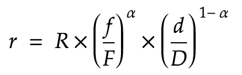</p>

| Term | Definition                                                                   |
| ---- | ---------------------------------------------------------------------------- |
| _r_  | Reward for a specific market maker.                                          |
| _R_  | Total reward to be split between all market makers.                          |
| _f_  | Total fees earned by the market maker this epoch.                            |
| _F_  | Total fees earned across all (staked) market maker pools this epoch.         |
| _d_  | Total weighted ZRX staked by the market maker's pool this epoch.             |
| _D_  | Total weighted ZRX staked across all (active) market maker pools this epoch. |
| _α_  | A constant in the range [0..1] that determines the weight of fees vs stake.  |

At the end of an epoch, each pool that traded can retrieve their liquidity reward. This is done by calling the finalize function. Dust pools (that have less than 100 ZRX staked) are not elegible for rewards.

```solidity
/// @dev Instantly finalizes a single pool that earned rewards in the previous
///      epoch, crediting it rewards for members and withdrawing operator's
///      rewards as WETH. This can be called by internal functions that need
///      to finalize a pool immediately. Does nothing if the pool is already
///      finalized or did not earn rewards in the previous epoch.
/// @param poolId The pool ID to finalize.
function finalizePool(bytes32 poolId)
    external;
```

Each pool has until the end of the epoch to finalize their pool for the previous epoch. During finalization the market maker will be paid their % of the reward in WETH. Pool members are paid when they modify how much stake they've delegated to the pool (or undelegate). Alternatively, members can retrieve their reward in WETH by calling the withdraw function.

```solidity
/// @dev Withdraws the caller's WETH rewards that have accumulated
///      until the last epoch.
/// @param poolId Unique id of pool.
function withdrawDelegatorRewards(bytes32 poolId) external;
```

Both operators and delegators can compute their unpaid balance in a pool using the functions below.

```solidity
/// @dev Computes the reward balance in ETH of the operator of a pool.
/// @param poolId Unique id of pool.
/// @return totalReward Balance in ETH.
function computeRewardBalanceOfOperator(bytes32 poolId)
    external
    view
    returns (uint256 reward);

/// @dev Computes the reward balance in ETH of a specific member of a pool.
/// @param poolId Unique id of pool.
/// @param member The member of the pool.
/// @return totalReward Balance in ETH.
function computeRewardBalanceOfDelegator(bytes32 poolId, address member)
    external
    view
    returns (uint256 reward);
```

#### Logic of `finalizePool`

Finalizing pays any unsettled liquidity rewards from the previous epoch to the pool.

1. Load the aggregated stats for the previous epoch.
2. If the epoch is finalized then return (NOP).
3. Load the pool's stats for the previous epoch.
4. If the pool is already finalized then return (NOP).
5. Delete the pool's stats from state.
6. Use in-memory aggregated/pool stats to compute the unsettled rewards owed to the pool.
7. Of the unsettled rewards, compute how much is owed to the operator and collectively how much to the pool members.
8. Pay reward in WETH to the operator.
9. Store the reward held collectively by the pool members in state. This is used later for each member to compute their individual portion.
10. Emit [RewardsPaid](https://github.com/0xProject/0x-monorepo/blob/development/contracts/staking/contracts/src/interfaces/IStakingEvents.sol#L83) Event.
11. Update aggregated stats in state to reflect that this pool's rewards have been settled.
12. If all pool's are settled then the previous epoch is finalized. Emit the [EpochFinalized](https://github.com/0xProject/0x-monorepo/blob/development/contracts/staking/contracts/src/interfaces/IStakingEvents.sol#L72) Event.

#### Precision of Rewards Computation

The [solidity](https://github.com/0xProject/0x-monorepo/blob/development/contracts/staking/contracts/src/libs/LibCobbDouglas.sol) implementation of the Cobb-Douglas function ultimately relies on [Taylor series approximations](https://github.com/0xProject/0x-monorepo/blob/development/contracts/staking/contracts/src/libs/LibFixedMath.sol) using fixed-point, signed-integer math. These approximations have an expected minimum precision of `12` digits.

This can result in very small errors in reward computation, in either direction. In order to guard against the sum of total rewards exceeding the total rewards available, the computed reward for a pool is always [clipped](https://github.com/0xProject/0x-monorepo/blob/development/contracts/staking/contracts/src/sys/MixinFinalizer.sol#L247) to the total (unfinalized) rewards remaining.

#### Errors by `finalizePool`

The errors in finalize pool are all math errors related to reward computation. If any of these are triggered then it indicates= an internal logic error.

| Error                                                                                                                                               | Condition                                                           |
| --------------------------------------------------------------------------------------------------------------------------------------------------- | ------------------------------------------------------------------- |
| [SignedValueError](https://github.com/0xProject/0x-monorepo/blob/development/contracts/staking/contracts/src/libs/LibFixedMathRichErrors.sol#51)    | An error in signed computation.                                     |
| [UnsignedValueError](https://github.com/0xProject/0x-monorepo/blob/development/contracts/staking/contracts/src/libs/LibFixedMathRichErrors.sol#L66) | An error in unsigned computation.                                   |
| [BinOpError](https://github.com/0xProject/0x-monorepo/blob/development/contracts/staking/contracts/src/libs/LibFixedMathRichErrors.sol#L81)         | An overflow or underflow error when performing unsigned arithmetic. |

#### Logic of `withdrawDelegatorRewards`

1. Assert the pool's rewards have been settled in the current epoch via `finalizePool`.
2. Compute the portion of the pool's reward owed to the delegator.
3. If the amount owed is non-zero then transfer it in WETH to the delegator.
4. Update reward tracking metrics to reflect that a delegator interacted with the pool. See [Section 10.3](#103-tracking-for-reward-balances-for-pool-members) for more information on reward tracking.

#### Errors by `withdrawDelegatorRewards`

| Error                                                                                                                                                 | Condition                                                                                                        |
| ----------------------------------------------------------------------------------------------------------------------------------------------------- | ---------------------------------------------------------------------------------------------------------------- |
| [PoolNotFinalizedError](https://github.com/0xProject/0x-monorepo/blob/development/contracts/staking/contracts/src/libs/LibStakingRichErrors.sol#L309) | The pool is not finalized: it is still owed rewards from the previous epoch. Fix this by calling `finalizePool`. |
| [BinOpError](https://github.com/0xProject/0x-monorepo/blob/development/contracts/staking/contracts/src/libs/LibFixedMathRichErrors.sol#L81)           | An overflow or underflow error when performing unsigned arithmetic.                                              |

## Batch Calls

The staking contract supports arbitrary batch function calls to the staking logic contract, allowing for several operations in a single transaction. For example, finalizing several pools in one transaction.

<p align="center">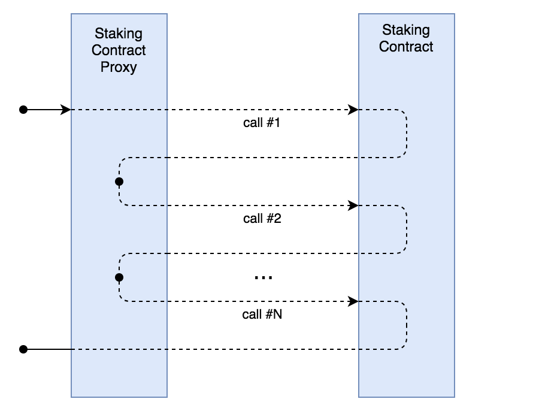</p>

```solidity
/// @dev Batch executes a series of calls to the staking contract.
/// @param data An array of data that encodes a sequence of functions to
///             call in the staking contracts.
function batchExecute(bytes[] calldata data)
    external
    returns (bytes[] memory batchReturnData);
```

#### Logic of `batchExecute`

1. Assert there is a `Staking` contract connected to the proxy.
2. Execute each call to the `Staking` contract, constructing an array of return data.
3. Revert if a single call fails.

#### Errors by `batchExecute`

| Error                                                                                                                                                            | Condition                                             |
| ---------------------------------------------------------------------------------------------------------------------------------------------------------------- | ----------------------------------------------------- |
| [ProxyDestinationCannotBeNilError](https://github.com/0xProject/0x-monorepo/blob/development/contracts/staking/contracts/src/libs/LibStakingRichErrors.sol#L286) | The `StakingProxy` has not been correctly configured. |

Note: any error generated in the Staking Logic contract will be propagated back to the client.

## Paying the Protocol Fee

Protocol fees are paid to the Staking contract by the Exchange contract. The Staking logic is unopinionated about the amount paid: it is the responsibility of the exchange to compute this value. The fee can be paid in either ETH or WETH and are paid out as rewards to staking pools during finalization.

```solidity
/// @dev Pays a protocol fee in ETH or WETH.
///      Only a known 0x exchange can call this method. See
///      (MixinExchangeManager).
/// @param makerAddress The address of the order's maker.
/// @param payerAddress The address of the protocol fee payer.
/// @param protocolFeeAmount The protocol fee amount. This is either passed as ETH or transferred as WETH.
function payProtocolFee(
    address makerAddress,
    address payerAddress,
    uint256 protocolFeeAmount
)
    external
    payable
    onlyExchange;
```

#### Logic of `payProtocolFee`

1. Assert that either (i) the value passed into the Staking contract matches the fee, or (ii) the amount passed in is zero.
2. If the amount of ETH passed in is zero, then transfer the fee as WETH. Note that users must have WETH allowance set on the `StakingProxy` to facilitate this transfer.
3. Lookup the staking pool the maker has associated with. If no pool, then return.
4. Check if the pool holds the minimum required stake (see [Section 3.6](#36-setting-params)).
5. If this is the first fee earned by the pool in this epoch, then:
   i. Record that they earned fees this epoch (and hence must be paid rewards in the next epoch, via finalization).
   ii. Emit the [StakingPoolEarnedRewardsInEpoch](https://github.com/0xProject/0x-monorepo/blob/development/contracts/staking/contracts/src/interfaces/IStakingEvents.sol#L49) Event.
6. Record the fee and attribute it to the pool.

#### Errors by `payProtocolFee`

| Error                                                                                                                                                          | Condition                                                                                                     |
| -------------------------------------------------------------------------------------------------------------------------------------------------------------- | ------------------------------------------------------------------------------------------------------------- |
| [InvalidProtocolFeePaymentError](https://github.com/0xProject/0x-monorepo/blob/development/contracts/staking/contracts/src/libs/LibStakingRichErrors.sol#L249) | The protocol fee paid by the Exchange as ETH was non-zero and did not match the expected protocol fee amount. |
| [StandardError("")](https://github.com/0xProject/0x-monorepo/blob/development/contracts/erc20/contracts/src/WETH9.sol#L65)                                     | The payer had an insufficient WETH balance.                                                                   |

## Interfaces

### Staking Logic Contract

This interface is defined in [IStaking](https://github.com/0xProject/0x-monorepo/blob/development/contracts/staking/contracts/src/interfaces/IStaking.sol).

```solidity
/// @dev Adds a new exchange address
/// @param addr Address of exchange contract to add
function addExchangeAddress(address addr)
    external;

/// @dev Computes the reward balance in ETH of a specific member of a pool.
/// @param poolId Unique id of pool.
/// @param member The member of the pool.
/// @return totalReward Balance in ETH.
function computeRewardBalanceOfDelegator(bytes32 poolId, address member)
    external
    view
    returns (uint256 reward);

/// @dev Computes the reward balance in ETH of the operator of a pool.
/// @param poolId Unique id of pool.
/// @return totalReward Balance in ETH.
function computeRewardBalanceOfOperator(bytes32 poolId)
    external
    view
    returns (uint256 reward);

/// @dev Create a new staking pool. The sender will be the operator of this pool.
/// Note that an operator must be payable.
/// @param operatorShare Portion of rewards owned by the operator, in ppm.
/// @param addOperatorAsMaker Adds operator to the created pool as a maker for convenience iff true.
/// @return poolId The unique pool id generated for this pool.
function createStakingPool(uint32 operatorShare, bool addOperatorAsMaker)
    external
    returns (bytes32 poolId);

function currentEpochStartTimeInSeconds()
    external
    view
    returns (uint256);

/// @dev Decreases the operator share for the given pool (i.e. increases pool rewards for members).
/// @param poolId Unique Id of pool.
/// @param newOperatorShare The newly decreased percentage of any rewards owned by the operator.
function decreaseStakingPoolOperatorShare(bytes32 poolId, uint32 newOperatorShare)
    external;

/// @dev Begins a new epoch, preparing the prior one for finalization.
///      Throws if not enough time has passed between epochs or if the
///      previous epoch was not fully finalized.
/// @return numPoolsToFinalize The number of unfinalized pools.
function endEpoch()
    external
    returns (uint256);

/// @dev Instantly finalizes a single pool that earned rewards in the previous
///      epoch, crediting it rewards for members and withdrawing operator's
///      rewards as WETH. This can be called by internal functions that need
///      to finalize a pool immediately. Does nothing if the pool is already
///      finalized or did not earn rewards in the previous epoch.
/// @param poolId The pool ID to finalize.
function finalizePool(bytes32 poolId)
    external;

/// @dev Returns the earliest end time in seconds of this epoch.
///      The next epoch can begin once this time is reached.
///      Epoch period = [startTimeInSeconds..endTimeInSeconds)
/// @return Time in seconds.
function getCurrentEpochEarliestEndTimeInSeconds()
    external
    view
    returns (uint256);

/// @dev Gets global stake for a given status.
/// @param stakeStatus UNDELEGATED or DELEGATED
/// @return Global stake for given status.
function getGlobalStakeByStatus(IStructs.StakeStatus stakeStatus)
    external
    view
    returns (IStructs.StoredBalance memory balance);

/// @dev Gets an owner's stake balances by status.
/// @param staker Owner of stake.
/// @param stakeStatus UNDELEGATED or DELEGATED
/// @return Owner's stake balances for given status.
function getOwnerStakeByStatus(
    address staker,
    IStructs.StakeStatus stakeStatus
)
    external
    view
    returns (IStructs.StoredBalance memory balance);

/// @dev Retrieves all configurable parameter values.
/// @return _epochDurationInSeconds Minimum seconds between epochs.
/// @return _rewardDelegatedStakeWeight How much delegated stake is weighted vs operator stake, in ppm.
/// @return _minimumPoolStake Minimum amount of stake required in a pool to collect rewards.
/// @return _cobbDouglasAlphaNumerator Numerator for cobb douglas alpha factor.
/// @return _cobbDouglasAlphaDenominator Denominator for cobb douglas alpha factor.
function getParams()
    external
    view
    returns (
        uint256 _epochDurationInSeconds,
        uint32 _rewardDelegatedStakeWeight,
        uint256 _minimumPoolStake,
        uint32 _cobbDouglasAlphaNumerator,
        uint32 _cobbDouglasAlphaDenominator
    );

/// @param staker of stake.
/// @param poolId Unique Id of pool.
/// @return Stake delegated to pool by staker.
function getStakeDelegatedToPoolByOwner(address staker, bytes32 poolId)
    external
    view
    returns (IStructs.StoredBalance memory balance);

/// @dev Returns a staking pool
/// @param poolId Unique id of pool.
function getStakingPool(bytes32 poolId)
    external
    view
    returns (IStructs.Pool memory);

/// @dev Get stats on a staking pool in this epoch.
/// @param poolId Pool Id to query.
/// @return PoolStats struct for pool id.
function getStakingPoolStatsThisEpoch(bytes32 poolId)
    external
    view
    returns (IStructs.PoolStats memory);

/// @dev Returns the total stake delegated to a specific staking pool,
///      across all members.
/// @param poolId Unique Id of pool.
/// @return Total stake delegated to pool.
function getTotalStakeDelegatedToPool(bytes32 poolId)
    external
    view
    returns (IStructs.StoredBalance memory balance);

/// @dev An overridable way to access the deployed WETH contract.
///      Must be view to allow overrides to access state.
/// @return wethContract The WETH contract instance.
function getWethContract()
    external
    view
    returns (IEtherToken wethContract);

/// @dev An overridable way to access the deployed zrxVault.
///      Must be view to allow overrides to access state.
/// @return zrxVault The zrxVault contract.
function getZrxVault()
    external
    view
    returns (IZrxVault zrxVault);

/// @dev Initialize storage owned by this contract.
///      This function should not be called directly.
///      The StakingProxy contract will call it in `attachStakingContract()`.
function init()
    external;

/// @dev Allows caller to join a staking pool as a maker.
/// @param poolId Unique id of pool.
function joinStakingPoolAsMaker(bytes32 poolId)
    external;

/// @dev Moves stake between statuses: 'undelegated' or 'delegated'.
///      Delegated stake can also be moved between pools.
///      This change comes into effect next epoch.
/// @param from status to move stake out of.
/// @param to status to move stake into.
/// @param amount of stake to move.
function moveStake(
    IStructs.StakeInfo calldata from,
    IStructs.StakeInfo calldata to,
    uint256 amount
)
    external;

/// @dev Pays a protocol fee in ETH.
/// @param makerAddress The address of the order's maker.
/// @param payerAddress The address that is responsible for paying the protocol fee.
/// @param protocolFeeAmount The amount of protocol fees that should be paid.
function payProtocolFee(
    address makerAddress,
    address payerAddress,
    uint256 protocolFeeAmount
)
    external
    payable;

/// @dev Removes an existing exchange address
/// @param addr Address of exchange contract to remove
function removeExchangeAddress(address addr)
    external;

/// @dev Set all configurable parameters at once.
/// @param _epochDurationInSeconds Minimum seconds between epochs.
/// @param _rewardDelegatedStakeWeight How much delegated stake is weighted vs operator stake, in ppm.
/// @param _minimumPoolStake Minimum amount of stake required in a pool to collect rewards.
/// @param _cobbDouglasAlphaNumerator Numerator for cobb douglas alpha factor.
/// @param _cobbDouglasAlphaDenominator Denominator for cobb douglas alpha factor.
function setParams(
    uint256 _epochDurationInSeconds,
    uint32 _rewardDelegatedStakeWeight,
    uint256 _minimumPoolStake,
    uint32 _cobbDouglasAlphaNumerator,
    uint32 _cobbDouglasAlphaDenominator
)
    external;

/// @dev Stake ZRX tokens. Tokens are deposited into the `ZrxVault`.
///      Unstake to retrieve the ZRX. Stake is in the 'Active' status.
/// @param amount of ZRX to stake.
function stake(uint256 amount)
    external;

/// @dev Unstake. Tokens are withdrawn from the `ZrxVault` and returned to
///      the staker. Stake must be in the 'undelegated' status in both the
///      current and next epoch in order to be unstaked.
/// @param amount of ZRX to unstake.
function unstake(uint256 amount)
    external;

/// @dev Withdraws the caller's WETH rewards that have accumulated
///      until the last epoch.
/// @param poolId Unique id of pool.
function withdrawDelegatorRewards(bytes32 poolId)
    external;
```

### `Staking` contract State

This interface is defined in [IStorage](https://github.com/0xProject/0x-monorepo/blob/development/contracts/staking/contracts/src/interfaces/IStorage.sol).

```solidity
function stakingContract()
    external
    view
    returns (address);

function lastPoolId()
    external
    view
    returns (bytes32);

function numMakersByPoolId(bytes32 poolId)
    external
    view
    returns (uint256);

function currentEpoch()
    external
    view
    returns (uint256);

function currentEpochStartTimeInSeconds()
    external
    view
    returns (uint256);

function protocolFeesThisEpochByPool(bytes32 poolId)
    external
    view
    returns (uint256);

function validExchanges(address exchangeAddress)
    external
    view
    returns (bool);

function epochDurationInSeconds()
    external
    view
    returns (uint256);

function rewardDelegatedStakeWeight()
    external
    view
    returns(uint32);

function minimumPoolStake()
    external
    view
    returns (uint256);

function cobbDouglasAlphaNumerator()
    external
    view
    returns (uint32);

function cobbDouglasAlphaDenominator()
    external
    view
    returns (uint32);
```

### `StakingProxy` Contract

This interface is defined in [IStakingProxy](https://github.com/0xProject/0x-monorepo/blob/development/contracts/staking/contracts/src/interfaces/IStakingProxy.sol).

```solidity
/// @dev Attach a staking contract; future calls will be delegated to the staking contract.
/// Note that this is callable only by an authorized address.
/// @param _stakingContract Address of staking contract.
function attachStakingContract(address _stakingContract)
    external;

/// @dev Detach the current staking contract.
/// Note that this is callable only by an authorized address.
function detachStakingContract()
    external;

/// @dev Asserts that an epoch is between 5 and 30 days long.
//       Asserts that 0 < cobb douglas alpha value <= 1.
//       Asserts that a stake weight is <= 100%.
//       Asserts that pools allow >= 1 maker.
//       Asserts that all addresses are initialized.
function assertValidStorageParams()
    external
    view;
```

### `ZrxVault`

This interface is defined in [IZrxVault](https://github.com/0xProject/0x-monorepo/blob/development/contracts/staking/contracts/src/interfaces/IZrxVault.sol).

```solidity
/// @dev Sets the address of the StakingProxy contract.
/// Note that only the contract staker can call this function.
/// @param _stakingProxyAddress Address of Staking proxy contract.
function setStakingProxy(address _stakingProxyAddress)
    external;

/// @dev Vault enters into Catastrophic Failure Mode.
/// *** WARNING - ONCE IN CATOSTROPHIC FAILURE MODE, YOU CAN NEVER GO BACK! ***
/// Note that only the contract staker can call this function.
function enterCatastrophicFailure()
    external;

/// @dev Sets the Zrx proxy.
/// Note that only the contract staker can call this.
/// Note that this can only be called when *not* in Catastrophic Failure mode.
/// @param zrxProxyAddress Address of the 0x Zrx Proxy.
function setZrxProxy(address zrxProxyAddress)
    external;

/// @dev Deposit an `amount` of Zrx Tokens from `staker` into the vault.
/// Note that only the Staking contract can call this.
/// Note that this can only be called when *not* in Catastrophic Failure mode.
/// @param staker of Zrx Tokens.
/// @param amount of Zrx Tokens to deposit.
function depositFrom(address staker, uint256 amount)
    external;

/// @dev Withdraw an `amount` of Zrx Tokens to `staker` from the vault.
/// Note that only the Staking contract can call this.
/// Note that this can only be called when *not* in Catastrophic Failure mode.
/// @param staker of Zrx Tokens.
/// @param amount of Zrx Tokens to withdraw.
function withdrawFrom(address staker, uint256 amount)
    external;

/// @dev Withdraw ALL Zrx Tokens to `staker` from the vault.
/// Note that this can only be called when *in* Catastrophic Failure mode.
/// @param staker of Zrx Tokens.
function withdrawAllFrom(address staker)
    external
    returns (uint256);

/// @dev Returns the balance in Zrx Tokens of the `staker`
/// @return Balance in Zrx.
function balanceOf(address staker)
    external
    view
    returns (uint256);

/// @dev Returns the entire balance of Zrx tokens in the vault.
function balanceOfZrxVault()
    external
    view
    returns (uint256);
```

### Structs

This interface is defined in [IStructs](https://github.com/0xProject/0x-monorepo/blob/development/contracts/staking/contracts/src/interfaces/IStructs.sol).

```solidity
/// @dev Stats for a pool that earned rewards.
/// @param feesCollected Fees collected in ETH by this pool.
/// @param weightedStake Amount of weighted stake in the pool.
/// @param membersStake Amount of non-operator stake in the pool.
struct PoolStats {
    uint256 feesCollected;
    uint256 weightedStake;
    uint256 membersStake;
}

/// @dev Holds stats aggregated across a set of pools.
/// @param rewardsAvailable Rewards (ETH) available to the epoch
///        being finalized (the previous epoch). This is simply the balance
///        of the contract at the end of the epoch.
/// @param numPoolsToFinalize The number of pools that have yet to be finalized through `finalizePools()`.
/// @param totalFeesCollected The total fees collected for the epoch being finalized.
/// @param totalWeightedStake The total fees collected for the epoch being finalized.
/// @param totalRewardsFinalized Amount of rewards that have been paid during finalization.
struct AggregatedStats {
    uint256 rewardsAvailable;
    uint256 numPoolsToFinalize;
    uint256 totalFeesCollected;
    uint256 totalWeightedStake;
    uint256 totalRewardsFinalized;
}

/// @dev Encapsulates a balance for the current and next epochs.
/// Note that these balances may be stale if the current epoch
/// is greater than `currentEpoch`.
/// @param currentEpoch the current epoch
/// @param currentEpochBalance balance in the current epoch.
/// @param nextEpochBalance balance in `currentEpoch+1`.
struct StoredBalance {
    uint64 currentEpoch;
    uint96 currentEpochBalance;
    uint96 nextEpochBalance;
}

/// @dev Statuses that stake can exist in.
///      Any stake can be (re)delegated effective at the next epoch
///      Undelegated stake can be withdrawn if it is available in both the current and next epoch
enum StakeStatus {
    UNDELEGATED,
    DELEGATED
}

/// @dev Info used to describe a status.
/// @param status of the stake.
/// @param poolId Unique Id of pool. This is set when status=DELEGATED.
struct StakeInfo {
    StakeStatus status;
    bytes32 poolId;
}

/// @dev Struct to represent a fraction.
/// @param numerator of fraction.
/// @param denominator of fraction.
struct Fraction {
    uint256 numerator;
    uint256 denominator;
}

/// @dev Holds the metadata for a staking pool.
/// @param operator of the pool.
/// @param operatorShare Fraction of the total balance owned by the operator, in ppm.
struct Pool {
    address operator;
    uint32 operatorShare;
}
```

## Events

### Staking Logic Contract

These events are defined in [IStakingEvents](https://github.com/0xProject/0x-monorepo/blob/development/contracts/staking/contracts/src/interfaces/IStakingEvents.sol).

```solidity
/// @dev Emitted by MixinStake when ZRX is staked.
/// @param staker of ZRX.
/// @param amount of ZRX staked.
event Stake(
    address indexed staker,
    uint256 amount
);

/// @dev Emitted by MixinStake when ZRX is unstaked.
/// @param staker of ZRX.
/// @param amount of ZRX unstaked.
event Unstake(
    address indexed staker,
    uint256 amount
);

/// @dev Emitted by MixinStake when ZRX is unstaked.
/// @param staker of ZRX.
/// @param amount of ZRX unstaked.
event MoveStake(
    address indexed staker,
    uint256 amount,
    uint8 fromStatus,
    bytes32 indexed fromPool,
    uint8 toStatus,
    bytes32 indexed toPool
);

/// @dev Emitted by MixinExchangeManager when an exchange is added.
/// @param exchangeAddress Address of new exchange.
event ExchangeAdded(
    address exchangeAddress
);

/// @dev Emitted by MixinExchangeManager when an exchange is removed.
/// @param exchangeAddress Address of removed exchange.
event ExchangeRemoved(
    address exchangeAddress
);

/// @dev Emitted by MixinExchangeFees when a pool starts earning rewards in an epoch.
/// @param epoch The epoch in which the pool earned rewards.
/// @param poolId The ID of the pool.
event StakingPoolEarnedRewardsInEpoch(
    uint256 indexed epoch,
    bytes32 indexed poolId
);

/// @dev Emitted by MixinFinalizer when an epoch has ended.
/// @param epoch The epoch that ended.
/// @param numPoolsToFinalize Number of pools that earned rewards during `epoch` and must be finalized.
/// @param rewardsAvailable Rewards available to all pools that earned rewards during `epoch`.
/// @param totalWeightedStake Total weighted stake across all pools that earned rewards during `epoch`.
/// @param totalFeesCollected Total fees collected across all pools that earned rewards during `epoch`.
event EpochEnded(
    uint256 indexed epoch,
    uint256 numPoolsToFinalize,
    uint256 rewardsAvailable,
    uint256 totalFeesCollected,
    uint256 totalWeightedStake
);

/// @dev Emitted by MixinFinalizer when an epoch is fully finalized.
/// @param epoch The epoch being finalized.
/// @param rewardsPaid Total amount of rewards paid out.
/// @param rewardsRemaining Rewards left over.
event EpochFinalized(
    uint256 indexed epoch,
    uint256 rewardsPaid,
    uint256 rewardsRemaining
);

/// @dev Emitted by MixinFinalizer when rewards are paid out to a pool.
/// @param epoch The epoch when the rewards were paid out.
/// @param poolId The pool's ID.
/// @param operatorReward Amount of reward paid to pool operator.
/// @param membersReward Amount of reward paid to pool members.
event RewardsPaid(
    uint256 indexed epoch,
    bytes32 indexed poolId,
    uint256 operatorReward,
    uint256 membersReward
);

/// @dev Emitted whenever staking parameters are changed via the `setParams()` function.
/// @param epochDurationInSeconds Minimum seconds between epochs.
/// @param rewardDelegatedStakeWeight How much delegated stake is weighted vs operator stake, in ppm.
/// @param minimumPoolStake Minimum amount of stake required in a pool to collect rewards.
/// @param cobbDouglasAlphaNumerator Numerator for cobb douglas alpha factor.
/// @param cobbDouglasAlphaDenominator Denominator for cobb douglas alpha factor.
event ParamsSet(
    uint256 epochDurationInSeconds,
    uint32 rewardDelegatedStakeWeight,
    uint256 minimumPoolStake,
    uint256 cobbDouglasAlphaNumerator,
    uint256 cobbDouglasAlphaDenominator
);

/// @dev Emitted by MixinStakingPool when a new pool is created.
/// @param poolId Unique id generated for pool.
/// @param operator The operator (creator) of pool.
/// @param operatorShare The share of rewards given to the operator, in ppm.
event StakingPoolCreated(
    bytes32 poolId,
    address operator,
    uint32 operatorShare
);

/// @dev Emitted by MixinStakingPool when a maker sets their pool.
/// @param makerAddress Adress of maker added to pool.
/// @param poolId Unique id of pool.
event MakerStakingPoolSet(
    address indexed makerAddress,
    bytes32 indexed poolId
);

/// @dev Emitted when a staking pool's operator share is decreased.
/// @param poolId Unique Id of pool.
/// @param oldOperatorShare Previous share of rewards owned by operator.
/// @param newOperatorShare Newly decreased share of rewards owned by operator.
event OperatorShareDecreased(
    bytes32 indexed poolId,
    uint32 oldOperatorShare,
    uint32 newOperatorShare
);
```

### `StakingProxy` Contract

These events are defined in [IStakingProxy](https://github.com/0xProject/0x-monorepo/blob/development/contracts/staking/contracts/src/interfaces/IStakingProxy.sol).

```solidity
/// @dev Emitted by StakingProxy when a staking contract is attached.
/// @param newStakingContractAddress Address of newly attached staking contract.
event StakingContractAttachedToProxy(
    address newStakingContractAddress
);

/// @dev Emitted by StakingProxy when a staking contract is detached.
event StakingContractDetachedFromProxy();
```

### `ZrxVault`

These events are defined in [IZrxVault](https://github.com/0xProject/0x-monorepo/blob/development/contracts/staking/contracts/src/interfaces/IZrxVault.sol).

```solidity
/// @dev Emmitted whenever a StakingProxy is set in a vault.
event StakingProxySet(address stakingProxyAddress);

/// @dev Emitted when the Staking contract is put into Catastrophic Failure Mode
/// @param sender Address of sender (`msg.sender`)
event InCatastrophicFailureMode(address sender);

/// @dev Emitted when Zrx Tokens are deposited into the vault.
/// @param staker of Zrx Tokens.
/// @param amount of Zrx Tokens deposited.
event Deposit(
    address indexed staker,
    uint256 amount
);

/// @dev Emitted when Zrx Tokens are withdrawn from the vault.
/// @param staker of Zrx Tokens.
/// @param amount of Zrx Tokens withdrawn.
event Withdraw(
    address indexed staker,
    uint256 amount
);

/// @dev Emitted whenever the ZRX AssetProxy is set.
event ZrxProxySet(address zrxProxyAddress);
```

## Algorithms, Data Structures & Design Patterns

This section dives deeper into the mechanics of the smart contracts.

### Securing the Proxy Pattern

The proxy pattern splits the state and logic into different contracts, allowing the logic contract to be upgraded. This is achieved using a `delegatecall` from the state contract into the logic contract.

One of the dangers in this pattern is that the storage slot or offset could change in a future version of Solidity. This could happen for any number of reasons; the most likely of which is that the order of state variables changes between two versions of the logic contract. An error like this would certainly be catastrophic, as the state variables in the logic contract would point to _different_ variables in the state contract.

One way to mitigate this danger is to store the state variables in a single immutable contract, which is inherited by both the state and logic contract. This will work, but it does not future-proof against external changes that may result from changes to Solidity or the EVM.

The best way we found to mitigate this danger is with runtime sanity checks. We hardcode the expected slot and offset of each state variable and assert the value every time the logic contract is updated. This is handled in the `Staking` contract constructor [here](https://github.com/0xProject/0x-monorepo/blob/development/contracts/staking/contracts/src/Staking.sol).

### Tracking for Reward Balances for Pool Members

This section describes the workflow for tracking and computing the portion of a pool's reward that belongs to a given member. The general equations for this are shown below.

A pool with _D_ delegated stake that earned _R_ rewards for its pool members in a given epoch, the reward (_r_) for a member that delegated _d_ stake is computed by:

<p align="center">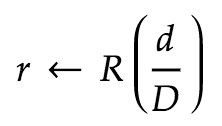</p>

The member's reward after n epochs (given member does not change their stake) is then given by:

<p align="center">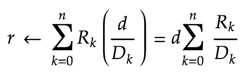</p>

When a member modifies their stake in the pool, the [StoredBalance struct](https://github.com/0xProject/0x-monorepo/blob/development/contracts/staking/contracts/src/interfaces/IStructs.sol) gives us:

1. How many epochs since they last modified their stake (`n`)
2. How much stake they had contributed during those epochs (`d`)

In addition to these values, we also need sum of ratios `R_k / D_k`, for each epoch `k` that the member was delegated. This ratio is available during the pool's finalization of epoch `k`. We are able to store this information concisely using a cumulative sum of these reward ratios, as follows:

We store the following ratio for each epoch that a reward is earned for the pool:

<p align="center">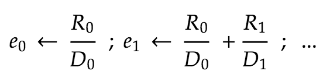</p>

We compute a member's reward using the following equation:

<p align="center">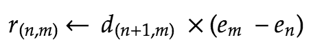</p>

Example:

<p align="center">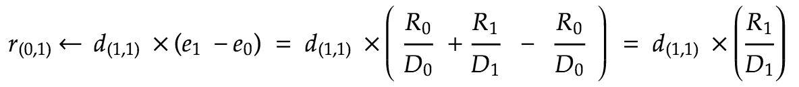</p>

With the cumulative reward along with the stored balance of a member, we are able to compute their reward in the pool at any time.

This information is stored on-chain as follows:

```solidity
// mapping from Owner to Pool Id to Amount Delegated
mapping (address  =>  mapping (bytes32  => StoredBalance)) internal _delegatedStakeToPoolByOwner;

// mapping from Pool Id to Amount Delegated
mapping (bytes32  => StoredBalance) internal _delegatedStakeByPoolId;

// mapping from Pool Id to Epoch to Reward Ratio
mapping (bytes32  =>  mapping (uint256  => Fraction)) internal _cumulativeRewardsByPool;
```

#### Computing Rewards in Practice

In the equations above, a staker earned rewards from epochs `[0..n]`. This means that the staker modified between epochs `n` and stopped earning rewards in epoch `n+1`. So at the time of the call, we don't have access to the reward for epoch `n`.

In practice, this equation becomes:

<p align="center">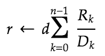</p>

The final equation for computing a member's reward during epoch `n` becomes:

<p align="center">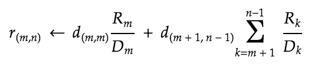</p>

#### Handling Epochs With No Rewards

To compute a member's reward using this algorithm, we need to know the cumulative rewards at the entry and exit epoch of the member. But, what happens if no reward was recorded during one of these epochs?

In this case, there will be `nil` entry in `cumulativeRewardsByPool`. However, this isn't a problem. If a reward is earned in epoch _n_ but not epoch _n + 1_ then the cumulative rewards will not have changed. So in epoch _n + 1_ we can simply use the entry for epoch _n_.

We keep track of the last epoch that the `cumulativeRewardsByPool` was updated in using the following state variable:

```solidity
// mapping from Pool Id to Epoch
mapping (bytes32  =>  uint256) internal cumulativeRewardsByPoolLastStored;
```

### Stake Management

Below are the design objectives of stake management:

1. Depositing ZRX mints stake that is is undelegated by default.
2. Withdrawing ZRX is done by unstaking; any undelegated stake can be unstaked.
3. Delegating, un-delegating and re-delegating stake comes into effect next epoch.
4. Users can freely adjust the distribution of their stake for the next epoch.

There are two statuses that stake can exist in: Undelegated or Delegated. Each has three fields:

1. How much stake is currently in this state (`currentEpochBalance` in the code; `cur` in the diagram below)
2. How much stake is in this state next epoch (`nextEpochBalance` in the code; `next` in the diagram below)
3. The last time this state was stored (`currentEpoch` in the code)

These fields combined allow us to compute the correct values at any given epoch without user intervention.

The amount that can be unstaked is equal to `min(undelegated.cur, undelegated.next)`.

The figure below illustrates how these fields are updated to track a user's stake.

<p align="center">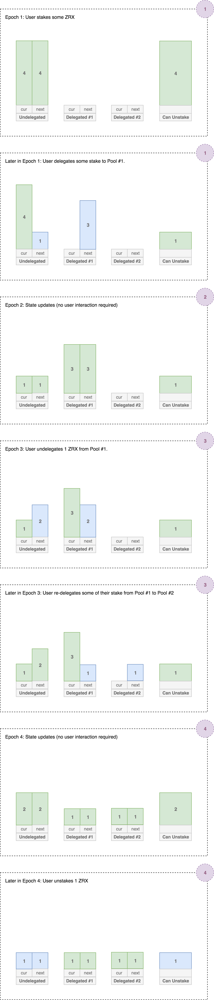</p>
