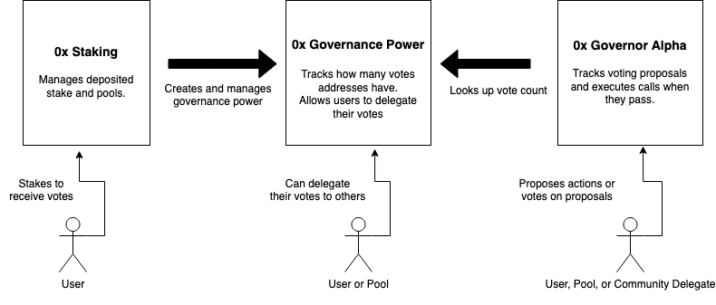

# Treasury Governance

## Overview

The 0x protocol is governed by the token holders who vote on changes to the protocol retrospectively to development and who have the power to allocate community funding prospectively to development. Token holders can vote onchain to use ZRX to fund improvements to the the 0x network.

The mechanism which enables that is a fork of the Compound governance contracts which has been integrated into the 0x staking system. ZRX tokens which are staked or locked into the staking contracts will receive voting power which can be used to vote on proposals or be delegated to community representatives.

### Technical Overview

<p align="center"></p>

The 0x staking contracts create votes for users when those users deposit ZRX token, they split that voting power between the user and the pool when a user stakes, and when a user withdraws or unstakes the created governance power is removed. The 0x staking contracts do so by calling access controlled functions on the 0x Governance Power contracts. The 0x staking contracts also have a method added which allows currently staked people to synchronize voting power.

The 0x Governance Power contract is based off a fork of the COMP token contract, but it has been stripped down to remove the transfer functionality and privileged functions have been added to create and remove voting power. Much like the COMP contracts it tracks user voting power, user delegation of voting power, and historical voting power balance lookups. It retains the `delegate` and `delegateBySig` methods of the COMP token.

The 0x Governor Alpha contracts are a direct fork of the Compound Governor Alpha contracts. Only cosmetic and naming changes have been made. A user with enough 0x voting power to meet the proposal threshold requirements can initiate a vote, which anyone with voting power at the instant of the creation of the vote can then vote on. If the vote meets Quorum and passes then after the timelock the proposed action can be executed. Detailed documentation of the Governor Alpha can be found [here](https://compound.finance/docs/governance#governor-alpha)

## Spesification

### Staking

#### Logic in `stake()`

When the staking flow described in the staking specification is completed, then the stake method will call the `mint` in the Governance power contract to grant the user voting power equivalent to the amount deposited.

#### Logic in `unstake()`

When the staking flow described in the staking specification is completed, then the stake method will call the `burn` in the Governance power contract to remove user voting power equivalent to the amount withdrawn.

#### Logic in `moveStake()`

In addition to preforming the staking functionality described in the staking specification the following is done:

1. If user is currently delegated, half of the amount moved is burned from the governance power of the current staking pool operator using `burn`.
2. If the user is currently unstaked, half of the amount moved is burned from the user by using `burn` on the governance contract.
3. If the user is moving stake to a pool, then half of the amount moved is minted as voting power for the staking pool operator by calling `mint` on the governance contract.
4. If the user is moving to undelegated, then half of the amount moved is minted as voting power to the user by calling `mint` on the governance power contract.

#### Logic of `synchronizeGovPower`

The method 'synchronizeGovPower' loads the message sender's staked and unstaked balance and then set's the users governance power to `unstaked_balance + 1/2 * staked_balance'. 'synchronizeGovPower' also loads the globally staked balance of the staked pool and sets the pool operator's governance power to half of their staked balance. Optionally, the method also delegates the created governance power on behalf of the user. It's interface is:

```solidity
    /// @dev Allows a user to look up their staked balances and
    ///      synchronize their voting power with the gov contract
    /// @param poolId Unique Id of pool.
    /// @param delegate The address that the caller wants to delegate to
    function synchronizeGovPower(bytes32 poolId, address delegate) external {
```

1. Load 'undelegatedBalance' and 'delegatedBalance' for 'msg.sender'
2. Calculate user governance power as 'undelegatedBalance + 1/2 delegatedBalance'
3. Call onchain governance to set user power to governance power
4. If user delegated balance is greater than zero:
5. Load global delegated balance for staking pool
6. Call onchain governance to set pool operator power to half delegated balance

### Onchain Governance Power Contracts

#### Logic of `mint()`

The mint function allows an address called the minter to increase the governance power balance for the user. If the indicated user is delegated then the creation of governance power will increase the current voting power of the address delegated to. This function only reverts if:

1. It is not called by the minter
2. The minted amount causes overflows

The interface is:

```solidity
    // This function allows the creation of new voting tokens
    // it is only callable by the minter.
    // It automatically self delegates the amount minted to the account
    // for which the tokens are minted.
    function mint(address account, uint96 amount) external {
```

#### Logic of `burn()`

The burn function allows the minter to decrease the governance power balance for a user. If the indicated user is delegated then the deletion of governance power will decrease the current voting power of the address delegated to. This function should only revert if called by an address which is not the minter. It is important to note that it will not revert if trying to burn too much an instead will set governance power to zero.

The interface is:

```solidity
    // This function removes voting tokens from existence
    // it is only callable by the 'minter' contract
    // It removes the delegates appropriate number of delegates
    // from whomever has been delegate to by this account.
    function burn(address account, uint96 amount) external {
```

#### Logic of `setVotingPower()`

The `setVotingPower()` function takes in an amount and address and then will either mint or burn in order to set the indicated address's voting power to the amount. If it mints, the logic is identical to `mint()` and if it burns the logic is identical to `burn()`. A convince input has been added which allows the caller to delegate on behalf of the user. If the delegator address is zero then no delegation is attempted. This function is only callable by the minter and will revert otherwise.

The interface is:

```solidity
    // This function sets the voting power to an indicated level
    // after the minter calls this function the voting power for 'account'
    // will be 'amount'
    function setVotingPower(address account, uint96 amount, address delegator) external {
```

#### Logic of `delegate()`

The delegate method is from the forked COMP token contracts, it allows a user to assign their voting power to another user. 
Users can only assign their voting power to one other user and can only assign their full balance. A user who delegates can still use historical balance for past votes, even if the delegation was made during a vote.

The interface is:

```solidity
    /**
     * @notice Delegate votes from `msg.sender` to `delegatee`
     * @param delegatee The address to delegate votes to
     */
    function delegate(address delegatee) public {
```

#### Logic of `delegateBySig()`

The logic of this method is identical to `delegate` except that instead of delegating for the message sender it delegates for the creator of a spec256k signature. The signature follows the EIP 721 standard. This method is an exact match to the forked comp method except the name of the contract is changed to `ZRX_GOVERNANCE`

```solidity
    /**
     * @notice Delegates votes from signatory to `delegatee`
     * @param delegatee The address to delegate votes to
     * @param nonce The contract state required to match the signature
     * @param expiry The time at which to expire the signature
     * @param v The recovery byte of the signature
     * @param r Half of the ECDSA signature pair
     * @param s Half of the ECDSA signature pair
     */
    function delegateBySig(address delegatee, uint nonce, uint expiry, uint8 v, bytes32 r, bytes32 s) public {
```

### Governor Alpha

The Governor Alpha contracts are an exact fork of Compound's Governor Alpha so we do not include a full specification here and instead direct the reader to [Compound's documentation](https://compound.finance/docs/governance#governor-alpha). Please note that the contract name was changed to `0x Governor Alpha` so to produce signatures for `voteBySig` the name will have to be changed in any relevant code. In addition various parameters such as Quorum and Proposal Threshold have changed.
